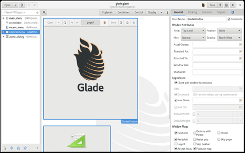
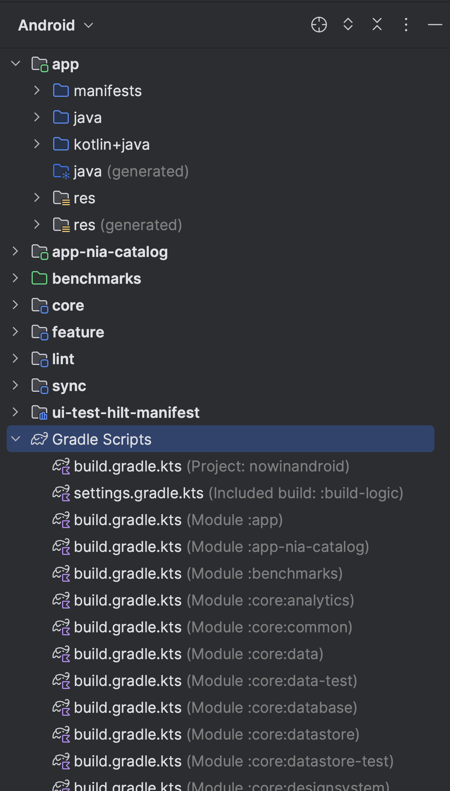
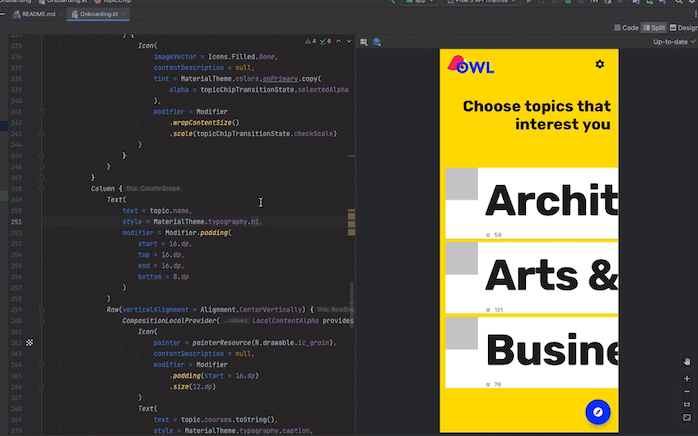
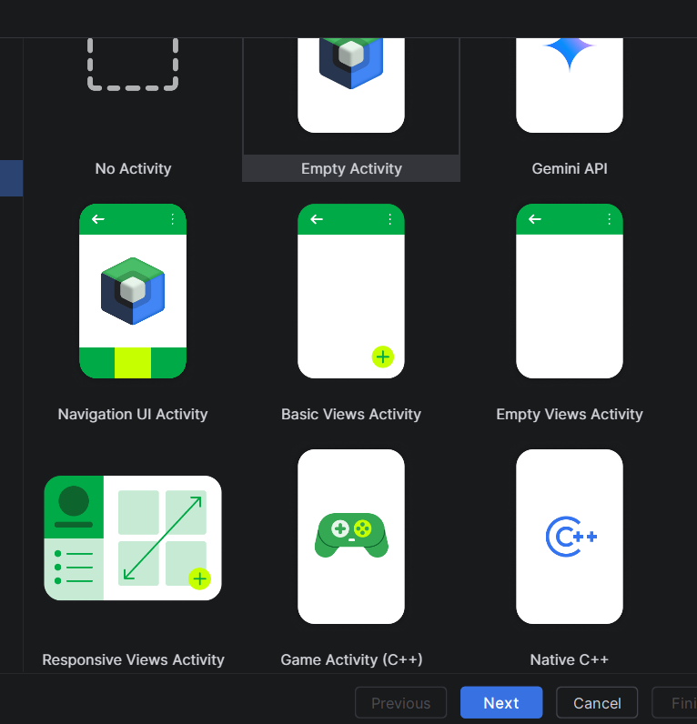

# Introducción a la confección de interfaces

!!! abstract "Idea principal"
    Este tema presenta el terreno de juego: qué es una interfaz, qué paradigmas hay detrás y, sobre todo, **el entorno donde vamos a trabajar todo el módulo: Android Studio con Kotlin y Jetpack Compose**. Al terminar tendremos el IDE instalado, creada la primera interfaz y conocidas las zonas del entorno de diseño.

## 1. Introducción y contextualización práctica

Un lenguaje de programación consiste en un conjunto de reglas y normas que permiten a una persona (en este caso un programador o programadora) escribir un conjunto de instrucciones interpretables por un ordenador, cuyo objetivo es controlar diferentes comportamientos lógicos o físicos de una máquina.

De manera tradicional se ha establecido una clasificación entre lenguajes de **bajo y alto nivel**. Los primeros se encuentran más cerca de lo que es capaz de entender un ordenador, ejercen un control directo sobre el hardware y están más alejados de la lógica humana (lenguaje máquina con 0 y 1, o lenguaje ensamblador). Los anteriores resultan muy difíciles de entender por una persona. Por esa razón aparecen los lenguajes de **alto nivel**, que pueden ser descritos utilizando reglas comprensibles por el programador, con un lenguaje más cercano al natural. Será durante el proceso de compilación del código fuente cuando estos se traduzcan a un lenguaje de bajo nivel, capaz de ser entendido por una máquina.

<figure markdown>

<figcaption>Fig. 1. Diagrama de lenguajes de alto y bajo nivel. Fuente: temario del módulo.</figcaption>
</figure>

**Kotlin**, el lenguaje que usaremos en este módulo, es de alto nivel: compila a bytecode que ejecuta la máquina virtual (JVM o ART en Android).

Ahora bien, las herramientas desarrolladas a través de un lenguaje de programación, sea del tipo que sea, requieren del desarrollo de una **interfaz** que permita la interacción con el usuario, de lo contrario se requeriría que todos fuéramos programadores expertos para utilizar cualquier aplicación atendiendo a su lenguaje fuente.

## 2. Paradigmas de programación

Un paradigma de programación define un estilo de programación: describe la estructura del programa que va a dar solución a los problemas computacionales.

En primer lugar encontramos el modelo **imperativo**, que consiste en un conjunto de instrucciones ordenadas de forma secuencial y claramente definidas para su ejecución en una máquina; es decir, definen un paso a paso. Este modelo se divide en otros tipos:

- **Programación estructurada**: incluye estructuras de control que permiten evaluar los casos para decidir entre un camino de instrucciones u otro. También incorpora estructuras iterativas.
- **Programación procedimental o basada en funciones**: subdivide el programa en subrutinas y funciones de menor tamaño que simplifican la programación, aligerando su implementación y posterior mantenimiento.
- **Programación modular**: permite desarrollar cada programa de forma completamente independiente al resto del código, lo que agiliza las tareas de implementación y prueba. Será en la parte final del proceso cuando se combinen todos los módulos, creando el software definitivo.

Algunos lenguajes conocidos que utilizan la programación imperativa son **Kotlin**, Java, C, C#, Python o Ruby.

En el modelo imperativo se indica la secuencia de pasos exacta a seguir para resolver un problema. Por el contrario, en el caso del modelo **declarativo** no se describen los pasos, sino el problema que se plantea. Algunos ejemplos de lenguajes declarativos son HTML, CSS y SQL.

## 3. Programación orientada a objetos, eventos y componentes

Encontramos otros modelos de programación que incluyen características propias de los definidos anteriormente. Es el caso de la programación orientada a objetos, eventos o componentes. **La combinación de estos tres tipos resulta clave para el desarrollo de las interfaces que veremos en este módulo.**

- **Modelo orientado a objetos**: el funcionamiento de este tipo de programas se basa en la creación de entidades, que reciben el nombre de **objetos**, las cuales tienen asociados atributos, propiedades y métodos. La interacción entre los objetos permite resolver los problemas de computación planteados. Algunos lenguajes orientados a objetos son Java, Ruby, Visual Basic, Perl, PHP, Python o **Kotlin**.
- **Modelo basado en eventos**: su funcionamiento viene determinado por acciones externas, por ejemplo, la pulsación sobre un botón. Uno de los lenguajes típicos de este tipo de programación es JavaScript, que utiliza manejadores de eventos tanto en el lado del cliente como del servidor (Node.js).
- **Modelo basado en componentes**: la clave de este último modelo es la **reutilización de módulos de software desarrollados previamente**. Para llevar a cabo esta tarea, la mayoría de los entornos de desarrollo integrados (IDE) permiten desarrollar componentes visuales, permitiendo empaquetar el código para reutilizarlo posteriormente.

En Jetpack Compose los tres modelos se dan cita: los composables son componentes reutilizables (que se definen una vez y se usan en cualquier pantalla), reaccionan a eventos (la pulsación de un botón) y se apoyan en objetos y clases de Kotlin.

## 4. Herramientas propietarias y libres de edición de interfaces

La motivación principal para utilizar herramientas de desarrollo software basado en componentes visuales radica en que, una vez empaquetados, se podrán compartir con otros desarrolladores y, por tanto, serán reutilizables. Esto supone un mayor ciclo de vida que el desarrollo tradicional por comandos. Si no se desarrolla utilizando componentes y se realiza de manera directa, se producirá un incremento de tiempo y costes asociados al proyecto.

Destacamos a continuación las principales herramientas de desarrollo software:

| Nombre | Licencia | Lenguajes soportados | Enlace |
|--------|----------|----------------------|--------|
| MonoDevelop | Libre | C#, Java, .NET, Python | monodevelop.com |
| Glade | Libre | C++, C#, Java, Python | glade.gnome.org |
| **Android Studio** | Libre | **Kotlin, Java** | developer.android.com/studio |

Tabla 1. Tabla comparativa de las herramientas de edición de interfaces (selección).

**4.1. MonoDevelop.** Este IDE libre y gratuito proporciona las funcionalidades propias de un editor de texto, además de las propias de un entorno para depurar y gestionar proyectos. Pertenece al ecosistema de Unity (motor de videojuegos multiplataforma), lo que resulta interesante porque permite desarrollar para Windows, macOS y Linux.

<figure markdown>

<figcaption>Fig. 2. Interfaz de la aplicación MonoDevelop. Fuente: temario del módulo.</figcaption>
</figure>

**4.2. Glade.** Este programa ayuda a la creación de interfaces gráficas de usuario y es muy utilizado en entornos XML, también para interfaces basadas en C, C++, C#, Java o Python. Su interfaz es bastante intuitiva y se domina invirtiendo poco tiempo. La principal diferencia respecto a las demás propuestas es que está diseñada pensando especialmente en GNU/Linux.

<figure markdown>

<figcaption>Fig. 3. Interfaz de la aplicación Glade. Fuente: temario del módulo.</figcaption>
</figure>

**4.3. Android Studio.** Es el IDE oficial para el desarrollo Android: gratuito, libre y multiplataforma, basado en IntelliJ IDEA. Reúne las virtudes de los anteriores (editor con autocompletado y detección de errores en tiempo real, depuración paso a paso, integración con Git/GitHub) y añade lo que da nombre al módulo moderno: la vista de diseño en vivo para **Jetpack Compose** (previsualización sin ejecutar la app), el emulador de dispositivos Android integrado y el soporte completo de **Kotlin**. Para completar esta asignatura vamos a utilizar **Android Studio**, puesto que su uso es el estándar profesional actual en el desarrollo de interfaces móviles.

<figure markdown>

<figcaption>Fig. 4. Lenguajes de programación de alto nivel. Fuente: temario del módulo.</figcaption>
</figure>

## 5. Librerías. Jetpack Compose

Algunos lenguajes de programación (entre ellos Kotlin) utilizan **librerías**: un conjunto de clases y funciones con sus propios atributos y métodos ya implementados. De esta forma pueden utilizarse para cualquier desarrollo reutilizando su código, lo cual reduce considerablemente el tiempo de programación. En cuanto al desarrollo de interfaces gráficas, para poder implementarlas debemos usar librerías que lo permitan.

En el desarrollo Android con Kotlin, la librería de interfaz es **Jetpack Compose**: el kit de herramientas oficial de Google para construir UIs. Sus componentes (botones, textos, campos de texto, contenedores...) son **funciones de Kotlin** anotadas con `@Composable` que se combinan entre sí para describir la pantalla.

Para poder utilizar las funciones y clases de estas librerías es necesario **importarlas** en Kotlin. Para ello se utiliza la palabra clave `import` seguida de la ruta del paquete que se va a agregar, justo después de la declaración del paquete, si esta existe:

```kotlin
import androidx.compose.material3.Button   // solo Button
import androidx.compose.material3.*        // todos los componentes Material 3
```

Código 1. Código para importar las librerías de Jetpack Compose.

Al igual que ocurría con las librerías clásicas de interfaces, Compose garantiza que el diseño y comportamiento de las aplicaciones será exactamente el mismo independientemente del fabricante del dispositivo, y proporciona componentes visuales avanzados con apariencia propia (Material Design 3).

## 6. Instalación de Android Studio

Para la implementación de interfaces en Kotlin se va a utilizar **Android Studio**, el entorno que integra todo lo necesario: editor, diseñador visual, emulador y el SDK de Android. A diferencia de otros IDE clásicos, no hay que instalar por separado ni el JDK (incluye uno embebido) ni la librería de interfaces: el asistente de proyectos añade Jetpack Compose automáticamente. El proceso de instalación se describe a continuación:

- Desde el sitio web oficial (<https://developer.android.com/studio>) se descarga el instalador correspondiente a nuestro sistema operativo (Windows, macOS o Linux) y se ejecuta.
- Seguimos el asistente con las opciones por defecto: tipo de instalación *Standard*, que instala el SDK de Android, sus plataformas y las herramientas de emulador. Este proceso ocupa pocos minutos.
- En el primer arranque, el asistente de configuración (setup wizard) descarga e instala los componentes restantes.
- Para ejecutar Android Studio basta con pulsar sobre el icono de la aplicación. La pantalla de bienvenida ofrece crear un nuevo proyecto o abrir uno existente.

Una vez completado este proceso, ya tendríamos instalado todo el entorno básico para el desarrollo de interfaces posterior.

## 7. Primer proyecto con Kotlin. La función composable

La importación de las librerías de Compose se realiza usando la sentencia `import androidx.compose...`, como vimos en el apartado anterior. Lo habitual es que el propio IDE añada estas importaciones automáticamente (con **Alt+Intro** sobre el elemento en rojo).

Uno de los elementos más importantes de Compose es la **función composable** (así la llamaremos en este módulo, como hace la comunidad y la mayoría de materiales en vídeo): una función de Kotlin anotada con `@Composable` que describe un trozo de interfaz. Sobre ella se añaden el resto de elementos.

!!! note "Si lees la documentación oficial en español"
    La documentación de Google traducida al español llama a esta función **"función de componibilidad"** (o "función que admite composición") y la abrevia como **"componible"**. Es exactamente el mismo concepto: la función anotada con `@Composable`. Nosotros diremos **composable**, que es como se oye en tutoriales, foros y equipos de trabajo.

```kotlin
@Composable                  // <- la ANOTACIÓN: marca la función
fun Saludo() {               // <- la FUNCIÓN composable en sí
    Text("Hola")
}
```

Es importante distinguir los dos términos para no mezclarlos:

| Término | Qué es | Ejemplo |
|---------|--------|---------|
| `@Composable` | La **anotación** que se escribe delante de la función | `@Composable fun Saludo()` |
| Función composable (o composable) | La **función** marcada con esa anotación, que describe la interfaz | `Saludo()`, `Text()`, `Button()` |

Se puede confundir el composable raíz con la **actividad** (`ComponentActivity`), pero mientras que la primera define la interfaz como tal, la segunda es la pantalla del sistema que la aloja: dentro de una actividad encontramos el `setContent { }` que "monta" nuestros composables.

La creación de nuestro primer proyecto se realiza en dos sencillos pasos:

- Desde la pantalla de bienvenida (o desde *File → New*) seleccionamos **New Project**.
- En la galería de plantillas elegimos **Empty Activity** (la plantilla básica con Compose), damos nombre al proyecto (por ejemplo `MiPrimeraInterfaz`), y pulsamos **Finish**.

Android Studio genera el proyecto con una actividad y su primer composable de ejemplo (`Greeting`). El resultado sería el mismo programándolo a mano, pero se recomienda partir de la plantilla porque deja configuradas las dependencias de Compose. La vista de diseño (Split/Design) estará disponible desde el primer momento.

### 7.1. La estructura del proyecto: qué es cada carpeta y para qué sirve

Al crear el proyecto, la vista **Android** del panel *Project* (a la izquierda del IDE) organiza los archivos de forma lógica en grupos que conviene dominar desde el primer día:

<figure markdown>

<figcaption>Fig. 5. La vista Android del panel Project agrupa el código por módulos y reúne todos los Gradle Scripts. Fuente: developer.android.com.</figcaption>
</figure>

```text
MiPrimeraInterfaz/
├── app/                          <- el módulo principal de la app
│   ├── manifests/                <- AndroidManifest.xml
│   ├── java/ y kotlin+java/      <- el código Kotlin (MainActivity.kt, composables)
│   └── res/                      <- recursos no-código
│       ├── drawable/             <- imágenes e iconos
│       ├── values/               <- strings.xml (textos), themes.xml (tema), colores
│       └── ...
├── Gradle Scripts/
│   ├── build.gradle.kts (Project)   <- config del proyecto entero
│   ├── build.gradle.kts (Module:app)<- config del módulo app (dependencias Compose)
│   ├── settings.gradle.kts          <- qué módulos forman el proyecto
│   └── gradle.properties            <- propiedades de la construcción
└── ...
```

| Elemento | Qué guarda | Para qué sirve |
|----------|-----------|----------------|
| `app/manifests/AndroidManifest.xml` | La "carta de identidad" de la app | Declara el nombre, el icono, las actividades (pantallas) y los permisos que necesita |
| `app/java` + `kotlin+java/` | El **código fuente Kotlin** | Aquí viven `MainActivity.kt` y todos los composables: la lógica y la interfaz |
| `app/res/drawable/` | Imágenes e iconos | Fondos, logos, gráficos que usa la interfaz |
| `app/res/values/strings.xml` | Los **textos** separados del código | Permiten traducir la app cambiando un solo archivo (buena práctica: nunca textos "duros" en Kotlin) |
| `app/res/values/themes.xml` | El tema de la app | Colores y tipografía de Material que heredan todas las pantallas |
| `build.gradle.kts (Project)` | La configuración global | Versión de las herramientas de compilación y repositorios de descarga |
| `build.gradle.kts (Module :app)` | Dependencias y versión de la app | Aquí está la lista de librerías: es donde vive **Jetpack Compose** |
| `settings.gradle.kts` | La lista de módulos | Define qué módulos (app, librerías propias...) forman el proyecto |

**Gradle** es el sistema de construcción: la herramienta que descarga las librerías, compila el código y genera el APK instalable. Cuando añadas una dependencia nueva, Android Studio te pedirá *Sync* (sincronizar): es Gradle descargándola y dejándola lista.

## 8. Análisis del entorno de diseño en Android Studio

El entorno de desarrollo de Android Studio para **Jetpack Compose es *code-first***: la interfaz se escribe en Kotlin y la herramienta de diseño la renderiza en vivo. A diferencia de los editores visuales clásicos (y del sistema de vistas XML anterior), **Compose no tiene paleta de componentes para arrastrar y soltar**: el código es la fuente de la verdad y la vista *Split/Design* es su espejo, que se redibuja al segundo. Los grupos de herramientas que describimos a continuación acompañan ese flujo de trabajo.

A continuación se describen los diferentes grupos de herramientas que podemos encontrar, tanto los de tipo general como los específicos del área de diseño.

**8.1. Toolbar.** En la barra de herramientas se encuentran los iconos relativos a las acciones genéricas: creación de proyectos y archivos, sincronización de Gradle, gestor de SDK, emulador... Uno de los botones más importantes es el encargado de la ejecución de la app (**Run** ▶). Al hacer clic sobre la flecha que se encuentra a su derecha (en realidad sobre el selector de dispositivo) se podrá seleccionar el emulador o dispositivo físico sobre el que ejecutar:

<figure markdown>

<figcaption>Fig. 6. El selector de dispositivos de la toolbar: emuladores disponibles (Pixel, Wear OS...), emparejar por Wi-Fi y acceso al Device Manager. Fuente: developer.android.com.</figcaption>
</figure>

**8.2. Vista de diseño. General.** La zona de diseño es la ventana principal del entorno con Compose: en ella se colocan los elementos de la interfaz. Android Studio ofrece tres modos combinables mediante pestañas: **Code** (solo código), **Split** (código y previsualización al mismo tiempo) y **Design** (solo previsualización). En la zona de previsualización se muestra el aspecto de la aplicación que se está implementando: podríamos decir que es el lienzo sobre el que dibujar la interfaz. Las funciones anotadas con `@Preview` se renderizan aquí en vivo, sin ejecutar la app:

<figure markdown>

<figcaption>Fig. 7. La vista Split: el código Kotlin a la izquierda y la preview de la interfaz renderizándose en vivo a la derecha (indicador "Up-to-date"). Fuente: developer.android.com.</figcaption>
</figure>

**8.3. El catálogo de componentes.** Los componentes gráficos son los elementos que permiten al usuario interaccionar con la aplicación; cada uno corresponde con una función de Kotlin con sus propios parámetros: textos (`Text`) y botones (`Button`), campos de texto (`TextField`), casillas de verificación (`Checkbox`), contenedores de disposición (`Column`, `Row`, `Box`), etc. En Compose ese catálogo **no vive en una paleta lateral sino en el propio lenguaje**: se insertan escribiendo su nombre y dejando que el autocompletado de Android Studio (**Ctrl+Espacio**) los ofrezca con su documentación y parámetros. Escribe `But`, acepta `Button` y la preview de la vista *Split* lo renderiza al instante. El autocompletado es, en la práctica, la "paleta" de Compose: cada componible que existe está a tres letras y un tabulador de distancia.

**8.4. Jerarquía y propiedades.** Compose conserva dos ayudas visuales heredadas de los editores clásicos, adaptadas al flujo code-first:

- **Component Tree**: el árbol con la jerarquía de lo escrito, como un explorador de carpetas pero de la interfaz. Aparece el nombre de la función componible (por ejemplo `Button` o `Text`); el texto que se muestra al usuario puede ser diferente y, en la mayor parte de los casos, lo será. Clic en el árbol → salta a esa línea de código; útil para seleccionar un elemento pequeño o anidado sin fallar el clic en la preview.
- **Parámetros de la función = propiedades.** No hay panel *Attributes*: las "propiedades" de cada componente son los **parámetros de su función Kotlin**. Las típicas de un botón: `enabled` (habilitar/deshabilitar), `colors` (colores), `modifier` (tamaño y alineación); y su contenido — el texto que ve el usuario — se declara entre las llaves del propio botón. Cambiar una propiedad es cambiar un argumento, y la preview se actualiza sola.

**8.5. Tipos de proyecto nuevos.** Al crear un *New Project*, la galería de plantillas de Android Studio ofrece varios puntos de partida. Estas son las plantillas disponibles para teléfono/tablet, que conviene saber distinguir:

<figure markdown>

<figcaption>Fig. 8. La galería de plantillas al crear un nuevo proyecto en Android Studio (captura del aula).</figcaption>
</figure>

| Plantilla | Qué genera | Cuándo usarla | Diferencia con las demás |
|-----------|-----------|---------------|--------------------------|
| **No Activity** | Solo la estructura del proyecto, sin ninguna pantalla | Módulos de librería o proyectos donde las pantallas se añaden luego a mano | La única sin actividad inicial: el lienzo más vacío posible |
| **Empty Activity** | Una actividad con una función composable vacía y Compose ya configurado | **La de este módulo**: partir de cero con la interfaz limpia | La mínima con Compose: sin navegación ni componentes precolocados |
| **Gemini API** | Actividad con el ejemplo ya conectado a la IA de Google (Gemini) | Explorar integración de IA generativa en la app | Incluye dependencias y código de IA; no es para UI base |
| **Navigation UI Activity** | Actividad con menú de navegación (barra inferior o lateral) y varias pantallas ya conectadas | Apps con varias secciones (Inicio, Perfil, Ajustes...) | Trae *navigation* ya montado: cambiar de pantalla sin escribirlo |
| **Basic Views Activity** | Actividad con el sistema clásico de vistas (XML) y estructura básica de menú | Mantener apps antiguas que usan Views con XML | UI imperativa sin Compose: el sistema anterior al que usaremos |
| **Empty Views Activity** | Una actividad con layout XML vacío (sistema clásico de vistas) | Solo para apps heredadas con Views | La versión "vacía" de la anterior: XML en vez de Compose |
| **Responsive Views Activity** | Actividad con diseño adaptativo que se ajusta a móvil, tablet y escritorio | Apps que deben verse bien en cualquier tamaño de pantalla | Centrada en adaptabilidad con breakpoints, también con Views |
| **Game Activity (C++)** | Proyecto de videojuego con el motor C++ (Native Game) | Juegos 2D/3D en C++ | Otro lenguaje y otro mundo: ni Kotlin ni UI de apps |
| **Native C++** | Proyecto con código nativo C++ enlazado con Kotlin/Java | Apps que necesitan máximo rendimiento o librerías nativas | Añade capa C++ (NDK) sobre la app normal |

Tabla 2. Plantillas de proyecto nuevo (teléfono/tablet) y sus diferencias.

Fíjate en el criterio de elección: para **interfaces con Compose** la opción es *Empty Activity* (o *Navigation UI Activity* si la app tiene varias secciones desde el inicio); las *Views* son el sistema clásico anterior; y las de C++ cambian de lenguaje por completo. En este módulo usaremos **Empty Activity**, que nos deja el lienzo limpio para construir la interfaz desde cero.

**8.6. ¿Y si quiero mi app en TODOS los sistemas operativos? Kotlin Multiplatform.** Las plantillas anteriores generan proyectos **Android**. Si el objetivo es una app que compile a la vez para Android, iOS, escritorio (Windows/macOS/Linux), web y servidor, JetBrains ofrece el **asistente de Kotlin Multiplatform** (kmp.jetbrains.com): marcas las plataformas objetivo y te genera el proyecto con la estructura compartida ya montada.

```text
kmp.jetbrains.com/?android=true&ios=true&iosui=compose&desktop=true&web=true&webui=compose&server=true
```

La idea de KMP: compartes en Kotlin lo común (lógica, datos, reglas de negocio) y decides si la UI también se comparte con **Compose Multiplatform** (la misma forma de escribir interfaces que aprendemos en este módulo, funcionando además en iOS, escritorio y web). No lo usaremos en el módulo — el objetivo es dominar Android con Compose —, pero conviene conocerlo: es la respuesta actual a "un solo proyecto, todos los SO", y todo lo que aprendas aquí de componibles te sirve directamente allí.

## 9. Caso práctico 1: "Creación de una pantalla"

**Planteamiento.** Los pasos imprescindibles para la creación de una pantalla con Compose son: declarar la función composable, describir su contenido y asignarla a la actividad con `setContent`. Implementa una pantalla desde cero utilizando solo el código de programación, es decir, sin utilizar la vista *Design*. Tras realizar este desarrollo, ¿cuál es una de las grandes diferencias que puedes observar entre las dos formas de creación descritas?

**Nudo.** En el siguiente código se muestra cada uno de los pasos descritos en el planteamiento: la actividad monta el contenido con `setContent` y la función composable `MiPrimeraInterfaz` describe lo que se ve en pantalla (un texto centrado).

```kotlin
class MainActivity : ComponentActivity() {
    override fun onCreate(savedInstanceState: Bundle?) {
        super.onCreate(savedInstanceState)
        setContent {                        // paso 2: asignar a la actividad
            MiPrimeraInterfaz()
        }
    }
}

@Composable                                  // paso 1: declarar el composable
fun MiPrimeraInterfaz() {                    // paso 3: describir el contenido
    Column(
        modifier = Modifier.fillMaxSize(),
        verticalArrangement = Arrangement.Center,
        horizontalAlignment = Alignment.CenterHorizontally
    ) {
        Text("Mi primera interfaz")
    }
}
```

Código 2. Código de creación de la primera pantalla.

**Desenlace.** El resultado del código anterior es una pantalla como la que se muestra a continuación, con el texto centrado sobre el fondo de la app. A diferencia de las ventanas de escritorio clásicas, no hay que indicar tamaño ni visibilidad: la interfaz ocupa toda la pantalla del dispositivo y se adapta a ella.

```text
┌─────────────────────────┐
│                         │
│                         │
│   Mi primera interfaz   │
│                         │
│                         │
└─────────────────────────┘
```

Es importante destacar que una de las principales diferencias a la hora de crear la interfaz directamente con código es que la vista *Split/Design* seguirá disponible para cualquier función `@Preview` que añadamos, pero no se genera automáticamente: la previsualización hay que declararla expresamente.

## 10. Caso práctico 2: "Creación de un botón"

**Planteamiento.** A lo largo del tema hemos analizado que la vista *Split* muestra el código y su previsualización al mismo tiempo: escribimos Kotlin a la izquierda y el resultado se redibuja a la derecha. Utilizando este flujo, crea dos botones que muestren las opciones **Aceptar** y **Cancelar**.

**Nudo.** Partiendo del proyecto del caso práctico anterior, sustituimos el contenido del componible por una fila (`Row`) con dos botones. Se escriben directamente en el editor (con **Ctrl+Espacio** para insertarlos con sus parámetros); la vista *Split* renderiza el resultado al instante:

```kotlin
@Composable
fun MiPrimeraInterfaz() {
    Row(
        modifier = Modifier.fillMaxSize(),
        horizontalArrangement = Arrangement.Center,
        verticalAlignment = Alignment.CenterVertically
    ) {
        Button(onClick = { }) {
            Text("Aceptar")
        }
        Button(onClick = { }) {
            Text("Cancelar")
        }
    }
}
```

Código 3. Dos botones en una fila.

**Desenlace.** La interfaz final que obtendremos corresponde con un resultado similar al que se muestra en la imagen, con los dos botones centrados en pantalla y la previsualización actualizándose en vivo en la vista *Split* mientras escribimos.

```text
┌─────────────────────────┐
│                         │
│                         │
│  [Aceptar]  [Cancelar]  │
│                         │
│                         │
└─────────────────────────┘
```

## 11. Resumen y resolución del caso práctico de la unidad

En este tema hemos visto que la librería **Jetpack Compose** contiene todas las funciones necesarias para programar todo tipo de componentes visuales como botones, textos, campos de edición o casillas de verificación, entre muchos otros. Para lograr una interfaz básica, será necesario hacer uso de al menos una **función composable** que describa la pantalla y poder añadirle objetos que sirvan para interactuar entre el usuario y la aplicación.

Hemos comprobado también que Compose es **code-first**: la interfaz se escribe en código Kotlin y la vista *Split/Design* es su previsualización en vivo. No existe paleta de arrastre: el catálogo de componentes vive en el autocompletado (**Ctrl+Espacio**) y las propiedades de cada componente son los parámetros de su función.

**Resolución del caso práctico de la unidad.** Como se ha visto a lo largo del tema, el proceso de implementación no solo es importante para el desarrollo de interfaces, sino también para tomar una serie de decisiones previas. Para el caso inicial del desarrollo de la interfaz de una **aplicación de bienvenida para el instituto**:

- **¿Qué tipo de componentes gráficos serán necesarios implementar en la interfaz?** Dadas las características de la interfaz, sería necesario utilizar textos para el título y la información, y un botón para la acción principal ("Entrar").
- **¿Cuál crees que sería el lenguaje más apropiado para desarrollar esta interfaz?** Tal y como se ha visto a lo largo del tema, para el desarrollo de una interfaz debemos utilizar lenguajes de alto nivel. En este caso se opta por el lenguaje **Kotlin**.
- **¿Qué entorno de desarrollo elegirías?** Dependiendo del lenguaje de programación que se vaya a utilizar y del tipo de interfaz, habrá que elegir un IDE u otro. En este caso, si se usa Kotlin para una app móvil, el IDE recomendado es **Android Studio**.
- **¿Conoces alguna librería específica para el desarrollo gráfico de interfaces?** Para la implementación de interfaces gráficas se requiere del uso de librerías que permitan el desarrollo de interfaces. En Kotlin para Android podemos utilizar **Jetpack Compose**.

## Bibliografía y fuentes

- Android Developers. *Descargar Android Studio*. <https://developer.android.com/studio>
- Android Developers. *Jetpack Compose documentation*. <https://developer.android.com/develop/ui/compose>
- Android Developers. *Thinking in Compose*. <https://developer.android.com/develop/ui/compose/mental-model>
- Kotlin Foundation. *Kotlin docs*. <https://kotlinlang.org/docs/home.html>
- JetBrains. *Kotlin Multiplatform — asistente de proyecto*. <https://kmp.jetbrains.com/>
- JetBrains. *Compose Multiplatform*. <https://www.jetbrains.com/compose/multiplatform/>
- Real Decreto 450/2010. Módulo profesional 0488 Desarrollo de interfaces.
- Temario del módulo como base conceptual de la adaptación.
