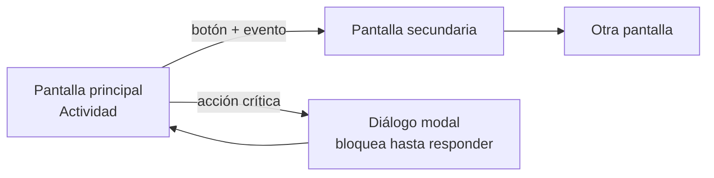
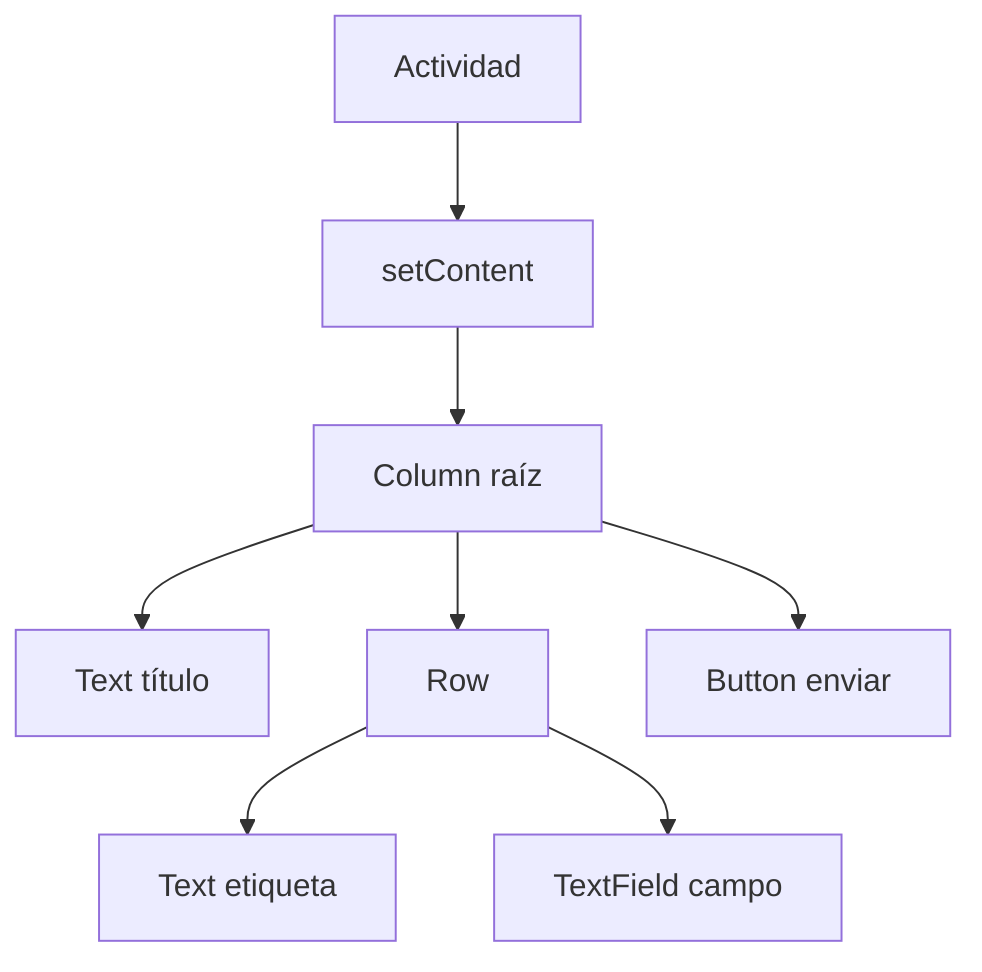
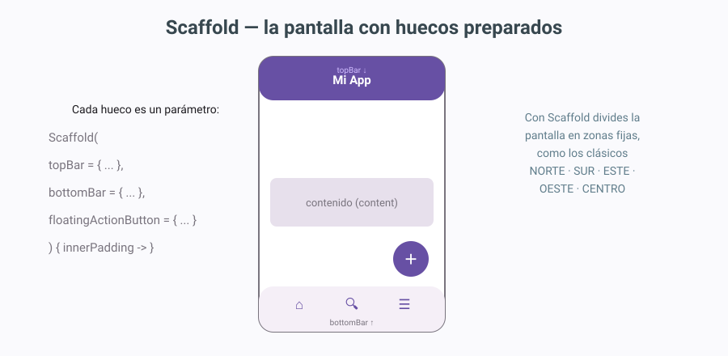
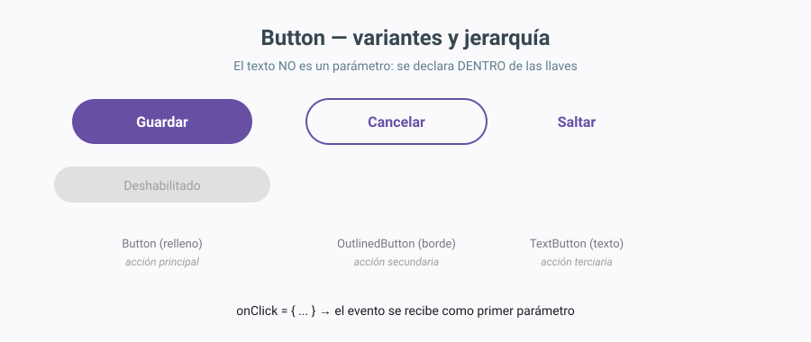
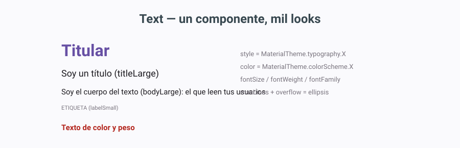
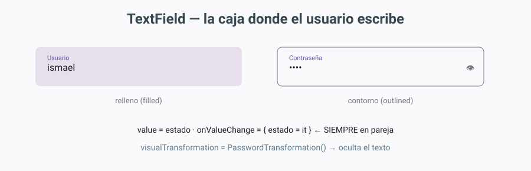
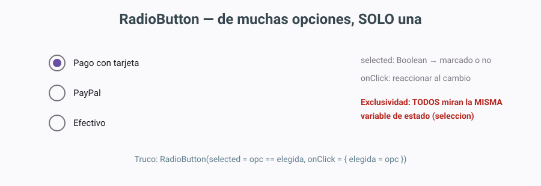
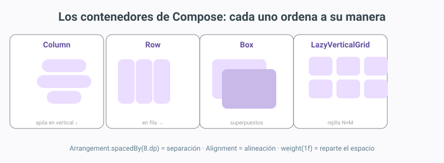
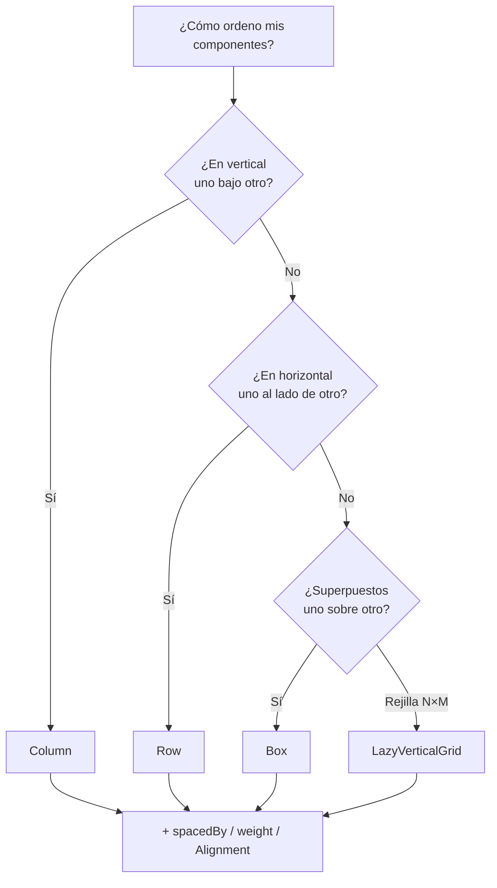

# Clases y componentes

!!! abstract "Idea principal"
    Este tema convierte la pantalla en un catálogo de piezas: los **componentes** (botones, textos, campos, selección) que recogen entradas del usuario, los **contenedores** que los ordenan (Column, Row, Box, Scaffold) y la forma de **conectar pantallas** entre sí mediante eventos. Al terminar sabrás montar una pantalla completa con disposición profesional y comportamiento real.

## 1. Introducción y contextualización práctica

El desarrollo de interfaces gráficas permite crear el canal de comunicación entre el usuario y la aplicación y, por esta razón, su diseño requiere especial atención. En la actualidad, las herramientas de desarrollo permiten implementar el código relativo a una interfaz a través de vistas de diseño que facilitan y hacen más intuitivo el proceso de creación.

Existen numerosos componentes: tipos de elementos que pueden incluirse en una interfaz simulando una comunicación bidireccional, en la que la aplicación recibe diferentes entradas de datos en función del componente escogido. Por ejemplo, sería posible que el usuario introduzca texto en una caja, seleccione un valor en un menú desplegable o se conecte a otras pantallas a través de la acción sobre un botón, entre otras.

En este tema se verán en detalle los principales tipos de componentes, así como sus características más importantes. La distribución de estos elementos depende de los llamados **layouts**: los contenedores que definen la ubicación exacta de los elementos. Una misma aplicación puede presentar más de una pantalla: la principal (la *actividad* que ya conoces del tema anterior) y las secundarias, a las que se llega **navegando** mediante eventos. Los **diálogos modales** completan el cuadro: ventanas que bloquean hasta que respondes.



**Objetivos de la unidad** (qué deberías saber hacer al terminar):

- Crear una interfaz combinando componentes en contenedores.
- Ubicar los componentes con los contenedores adecuados (layouts).
- Modificar las propiedades de los componentes para adecuarlas a las necesidades de la aplicación.
- Asociar las acciones correspondientes a los eventos.
- Analizar el código generado y modificarlo.
- Desarrollar una aplicación completa que incluye la interfaz gráfica obtenida.

## 2. El área de diseño en Compose: código y preview en vivo

Conocer en profundidad el área de diseño (lo que en los entornos clásicos se llamaba "explotar el área de diseño") sigue siendo fundamental para un correcto desarrollo; lo que cambia es la mecánica. En el tema anterior recorrimos el entorno completo; aquí lo explotamos para construir de verdad.

**Primero, una verdad incómoda que conviene saber desde el primer día: en Jetpack Compose no hay paleta de arrastrar y soltar.** Ese flujo de trabajo "visual" (abrir una paleta, arrastrar un botón al lienzo y que se genere código) era el del sistema clásico de Views con XML y el de los editores visuales históricos. Compose apuesta por lo contrario: **primero el código**. Tú escribes la llamada en Kotlin (`Text(`, `Button(`, `Column {`) y la **vista Split** renderiza la interfaz en vivo a tu lado, al segundo. Escribir código ya no significa "no ver nada hasta ejecutar".

El flujo de trabajo es siempre el mismo: escribes el componible en la vista *Code*, y la vista *Split* te muestra el resultado renderizándose en vivo (y si te equivocas, en rojo). Las zonas del entorno que sí usaremos a diario son:

<figure markdown>

<figcaption>Fig. 1. El área de diseño de Compose es la vista Split: escribes Kotlin a la izquierda y la interfaz se renderiza en vivo a la derecha, sin ejecutar la app.</figcaption>
</figure>

- **Editor (Code)**: donde escribes las llamadas a los composables en Kotlin. Es el corazón del desarrollo Compose: aquí se inserta, se modifica y se elimina todo.
- **Zona de preview (Split/Design)**: el lienzo donde se renderiza en vivo lo que escribes. Las funciones anotadas con `@Preview` se dibujan aquí sin ejecutar la app; al hacer clic sobre un elemento de la preview, Android Studio te lleva a su línea exacta de código (y al revés).
- **Component Tree**: el mapa jerárquico de los elementos en pantalla, como un explorador de carpetas pero de la interfaz. Aparece en la vista Design al lado de la preview y sirve para seleccionar (y borrar) elementos sin acertar a clicarlos en el dibujo.

Por ejemplo, si escribimos un `Button` dentro de un `Column`, en la preview aparece el botón renderizado al segundo, el *Component Tree* gana esa rama y al hacer clic sobre el botón (en la preview o en el árbol) el editor salta a su línea exacta:

```kotlin
@Composable
fun EjemploAreaDiseno() {
    Column {
        Text("Hola")                    // ya estaba en el árbol
        Button(onClick = { }) {         // lo escribimos: aparece en la preview al segundo
            Text("Púlsame")             // el texto del botón, dentro de sus llaves
        }
    }
}
```

Código 1. Lo que pasa al escribir un Button dentro de un Column: aparece en la preview al segundo, gana su rama en el Component Tree y al clicar sobre él (preview o árbol) el editor salta a su línea. Las dos vistas son espejos del mismo código.

### 2.1. Insertar elementos

En Compose, insertar un elemento es **escribir su llamada** dentro del contenedor adecuado: añades `Button(onClick = { }) { Text("Púlsame") }` dentro de las llaves de un `Column` y listo — la preview lo renderiza al segundo. Dos ayudas del IDE que sustituyen a la vieja paleta: el **autocompletado** (escribes `Butt` + Ctrl+Espacio y te ofrece Button, ButtonDefaults, OutlinedButton... con sus parámetros visibles) y la **paleta de plantillas del editor** (en la vista Design, Android Studio ofrece insertar composables habituales con un clic). El elemento queda insertado **dentro** del contenedor donde escribas la llamada: las dos vistas son espejos del mismo código.

```kotlin
// ANTES: un Column con un solo Text
Column {
    Text("Hola")
}

// DESPUÉS de insertar un TextField (escribir su llamada: la preview lo pinta al segundo)
Column {
    Text("Hola")
    OutlinedTextField(                  // insertado dentro del Column
        value = nombre,
        onValueChange = { nombre = it },
        label = { Text("Escribe tu nombre") }
    )
}
```

Código 2. Insertar un elemento es escribir su llamada dentro del contenedor: la preview lo pinta al segundo. El autocompletado (Ctrl+Espacio) te guía con los parámetros.

### 2.2. Eliminar elementos

Para eliminar un elemento hay dos caminos. El rápido: hacer clic sobre él en la **preview** (o seleccionarlo en el *Component Tree*) y pulsar **Supr** — el IDE localiza su llamada y la borra completa. El manual: ir a la vista *Code*, localizar la llamada del componible y eliminarla entera (con sus llaves y parámetros). El primero es más rápido y seguro porque el IDE se asegura de borrar todo el bloque.

```kotlin
// ANTES: el Column con el TextField insertado
Column {
    Text("Hola")
    OutlinedTextField(
        value = nombre,
        onValueChange = { nombre = it },
        label = { Text("Escribe tu nombre") }
    )
}

// DESPUÉS de eliminar el TextField (clic en la preview + Supr, o borrar la llamada entera):
Column {
    Text("Hola")
}
```

Código 3. Eliminar un elemento es quitar su llamada completa del contenedor: seleccionar + Supr lo hace en un clic; a mano en Code hay que borrar la llamada entera, con sus llaves y todos sus parámetros.

!!! tip "Regla de oro de las llaves"
    Al borrar a mano en *Code*, cuenta las llaves: cada componible abre `{` y cierra `}`. Si borras una de más o de menos, el error aparecerá al final del archivo (ya lo vivimos en el tema 1: *"Expecting ')'"* en la última línea suele significar una llave perdida más arriba).

## 3. Clases, propiedades y métodos en POO

Antes de entrar en componentes conviene repasar el lenguaje en el que están escritos: Kotlin es un lenguaje orientado a objetos, y los composables son funciones que viven dentro de clases y usan objetos por todas partes.

### 3.1. Clases

Una clase representa un conjunto de objetos que comparten una misma **estructura** (atributos) y **comportamiento** (métodos). A partir de una clase se pueden instanciar tantos objetos como se quieran: para ello se utilizan los **constructores**.

En Kotlin, la instanciación de una clase para crear un nuevo objeto se hace con el nombre de la clase seguido de un par de paréntesis — sin la palabra `new`:

```kotlin
val circulo = Circulo(4.0)     // instanciar: crear un objeto de la clase
```

Un constructor es sintácticamente muy semejante a una función. Puede recibir argumentos, y de hecho en Kotlin existen los **parámetros con valor por defecto** y la posibilidad de declarar el constructor primario directamente en la cabecera de la clase. Aunque no se defina explícitamente, siempre existe un **constructor por defecto** sin argumentos (si todos los parámetros tienen valor por defecto).

### 3.2. Métodos

Los métodos definen el comportamiento de un objeto: toda acción que se quiera realizar sobre la clase tiene que estar previamente definida en un método. Los métodos pueden recibir argumentos o no y, en función de su definición, devolverán un valor o realizarán alguna modificación sobre los atributos de la clase. En Kotlin una función se declara con `fun`, y si no devuelve nada su tipo es `Unit` (equivalente al `void` clásico).

### 3.3. Propiedades o atributos

Un objeto es una cápsula que contiene todos los datos y métodos ligados a él. Los atributos definen las características del objeto; por ejemplo, si se tiene una clase `Circulo`, sus atributos podrían ser el radio y el color. Estos constituyen la estructura del objeto, que posteriormente podrá ser modelada a través de los métodos oportunos.

```kotlin
class Circulo(
    var radio: Double = 1.0,           // atributo (propiedad)
    var color: String = "azul"         // atributo (propiedad)
) {
    fun area(): Double = Math.PI * radio * radio   // método
    fun crecer() { radio *= 2 }                     // método que modifica atributos
}

val c = Circulo(radio = 2.0)   // objeto (instancia)
println(c.area())              // 12.566...
c.crecer()                     // radio pasa a 4.0
```

Código 4. Estructura de una clase Kotlin: atributos en el constructor, métodos en el cuerpo. Es el equivalente Compose-friendly de la estructura clásica atributos-constructor-métodos.

Y un ejemplo directo de interfaz: una clase `Contacto` cuyos atributos alimentan una tarjeta visual. Fíjate cómo cada atributo del objeto acaba pintado en un componente de la interfaz:

```kotlin
class Contacto(
    var nombre: String,          // atributo → Text(titleLarge)
    var telefono: String,        // atributo → Text(bodyMedium)
    var favorito: Boolean        // atributo → cambia el color del botón
)

@Composable
fun TarjetaContacto(contacto: Contacto) {
    Row(verticalAlignment = Alignment.CenterVertically) {
        Column(modifier = Modifier.weight(1f)) {
            Text(contacto.nombre,                       // el atributo nombre
                 style = MaterialTheme.typography.titleLarge)
            Text(contacto.telefono,                     // el atributo telefono
                 style = MaterialTheme.typography.bodyMedium)
        }
        Button(onClick = { contacto.favorito = !contacto.favorito }) {
            // el atributo favorito decide el color del botón
            Text(if (contacto.favorito) "★" else "☆")
        }
    }
}

// uso: crear el objeto (instanciar) y pasarlo a la interfaz
TarjetaContacto(Contacto(nombre = "María", telefono = "600123456", favorito = true))
```

Código 5. Los atributos de un objeto alimentando la interfaz: `nombre` y `telefono` se pintan en los Text, y `favorito` decide qué muestra el botón. Los datos viven en el objeto; la interfaz los lee para dibujarse.

!!! note "Por qué esto importa en Compose"
    El **estado** de una pantalla (`var contador by remember { mutableIntStateOf(0) }`) es exactamente esto: una propiedad que vive en un objeto observado, y que al cambiar provoca que la interfaz se redibuje. La POO no es repaso burocrático: es el motor del `remember` que usaremos en los casos prácticos.

## 4. La pantalla y sus contenedores

En el tema anterior vimos que la **actividad** (`ComponentActivity`) es la pantalla del sistema que aloja la interfaz, y que `setContent { }` monta dentro los composables. Profundicemos ahora en la organización **dentro** de esa pantalla.

### 4.1. La actividad: la ventana principal

La actividad es el equivalente funcional de la ventana principal de una aplicación de escritorio: define la pantalla, su ciclo de vida y su conexión con el sistema. Sobre ella se monta todo lo demás. Una aplicación **solo** necesita una actividad si sus pantallas secundarias son simples (se navega entre composables dentro de la misma actividad).

### 4.2. Los paneles: composables contenedores

Complementando la actividad tenemos los **contenedores**: composables que no se ven por sí mismos (no pintan nada) pero que **organizan** a otros. Son el equivalente de los paneles clásicos: bloques "invisibles" sobre los que se ubican los elementos, sin colocarlos directamente sobre la ventana.

```kotlin
@Composable
fun MiPanel() {
    Column {                       // contenedor: apila en vertical
        Text("Título de la sección")
        Row {                      // contenedor: fila horizontal
            Text("Nombre:")
            TextField(value = "", onValueChange = { })
        }
    }
}
```

Código 6. Contenedores anidados: un `Column` que contiene un `Row` con dos elementos. Cada nivel de anidamiento es un "panel" que agrupa y ordena.

Gracias a los contenedores podemos tener la interfaz mucho más organizada. La combinación de contenedores constituye un **sistema de capas** (el "layout" del que hablaremos en el apartado 8): Column dentro de Box, Row dentro de Column, y así hasta diseñar cualquier estructura.



### 4.3. Scaffold: la pantalla con huecos preparados

<figure markdown>

<figcaption>Fig. 1. Scaffold: una pantalla completa con huecos preparados para cabecera, contenido, botón flotante y barra inferior.</figcaption>
</figure>

Cuando la pantalla crece, Compose ofrece **Scaffold**: un contenedor de pantalla completa que trae **huecos preparados** (slots) para las piezas típicas de una app: `topBar` (cabecera), `bottomBar` (barra inferior de navegación), `floatingActionButton` (el botón redondo flotante) y el `content` central. Es el esqueleto estándar de las apps Material:

```kotlin
@OptIn(ExperimentalMaterial3Api::class)
@Composable
fun MiPantalla() {
    Scaffold(
        topBar = { TopAppBar(title = { Text("Mi App") }) }
    ) { innerPadding ->
        Column(modifier = Modifier.padding(innerPadding)) {
            Text("Contenido de la app")
        }
    }
}
```

Código 7. Scaffold con cabecera. `innerPadding` entrega el espacio ocupado por topBar/bottomBar: si no lo aplicas, tu contenido queda tapado bajo la cabecera.

## 5. Diálogos: AlertDialog

Las aplicaciones que solo usan una pantalla no necesitan nada más; pero cuando la app presenta información crítica o requiere confirmación, entran los **diálogos**.

<figure markdown>

<figcaption>Fig. 2. El diálogo modal: bloquea la pantalla de atrás (atenuada) hasta que el usuario responde.</figcaption>
</figure>

Un **diálogo modal** es una ventana que aparece sobre la pantalla y **no permite interactuar con nada más** hasta que se cierra: la app queda a la espera de una respuesta. Por ejemplo, la selección del número de asiento en una compra de billetes, o la confirmación de borrado de un dato. Los diálogos **no modales** (como las *bottom sheets*, láminas que suben desde abajo) permiten seguir usando la pantalla mientras están abiertos.

```kotlin
var mostrarDialogo by remember { mutableStateOf(false) }

if (mostrarDialogo) {
    AlertDialog(
        onDismissRequest = { mostrarDialogo = false },   // cierra al pulsar fuera
        title = { Text("¿Cerrar sesión?") },
        text = { Text("Se perderán los cambios sin guardar.") },
        confirmButton = {
            TextButton(onClick = { /* cerrar sesión */ mostrarDialogo = false }) {
                Text("Aceptar")
            }
        },
        dismissButton = {
            TextButton(onClick = { mostrarDialogo = false }) {
                Text("Cancelar")
            }
        }
    )
}
```

Código 8. Diálogo modal con AlertDialog: el estado `mostrarDialogo` decide si se muestra; `onDismissRequest` lo cierra al pulsar fuera; los dos botones son composables completos.

!!! tip "La receta del diálogo"
    1. Una variable de estado (`mutableStateOf(false)`) que controla si se ve.
    2. Un `if (mostrarDialogo) { AlertDialog(...) }`.
    3. Todo botón que deba abrirlo pone `mostrarDialogo = true` en su `onClick`.
    Es la misma receta para diálogos de fecha, hora o confirmación de borrado.

## 6. Conexión entre pantallas. Navegación y eventos

Para crear una conexión entre dos o más pantallas, primero hay que crearlas todas (cada una es una función componible). El paso de una a otra se produce tras la ocurrencia de un **evento**, habitualmente la pulsación de un botón.

<figure markdown>

<figcaption>Fig. 3. La navegación: cada pantalla es un componible registrado en un NavHost; el evento onClick dispara navigate().</figcaption>
</figure>

El sistema estándar es la librería **Navigation Compose**: un `NavHost` registra las pantallas (cada una con su **ruta**, un nombre único) y el `NavHostController` (que se obtiene con `rememberNavController()`) permite saltar de una a otra:

```kotlin
@Composable
fun AppNavegacion() {
    val navController = rememberNavController()
    NavHost(navController = navController, startDestination = "login") {
        composable("login") { PantallaLogin(navController) }
        composable("bienvenida") { PantallaBienvenida() }
    }
}

@Composable
fun PantallaLogin(navController: NavController) {
    Button(onClick = { navController.navigate("bienvenida") }) {
        Text("Iniciar sesión")
    }
}
```

Código 9. Navegación entre dos pantallas: el NavHost las registra por ruta; el onClick del botón dispara navigate(). Requiere añadir la dependencia `androidx.navigation:navigation-compose` en Gradle (más abajo, apartado de dependencias).

**Los eventos en Compose** funcionan así: cada componente interactivo recibe su manejador como parámetro — `onClick` para botones y filas, `onValueChange` para campos de texto, `onCheckedChange` para casillas, `onDismissRequest` para diálogos. No hay que registrar listeners ni clases auxiliares: el evento es un parámetro más de la función, una lambda entre llaves que se ejecuta cuando ocurre la acción.

```kotlin
// el evento es una lambda: el código entre llaves se ejecuta al pulsar
Button(onClick = {
    println("Botón pulsado")              // acción 1
    contador++                            // acción 2: cambia el estado
}) {
    Text("Púlsame")
}
```

Código 10. El evento como parámetro: onClick recibe una lambda con todas las acciones que se ejecutan al pulsar. Cambiar el estado (contador) redibuja la interfaz automáticamente.

!!! note "Dependencia de Navigation"
    Navigation Compose no viene incluida por defecto en la plantilla Empty Activity. Para usarla, añade en `gradle/libs.versions.toml` la línea de navigation-compose y en `build.gradle.kts (Module :app)` la dependencia (o directamente la línea `implementation("androidx.navigation:navigation-compose:2.8.x")`), y pulsa **Sync**. Android Studio te lo recuerda con Alt+Intro → Add dependency.

## 7. Componentes

Existe un amplio abanico de componentes. En este apartado se verán los que constituyen la gran parte de las interfaces. Los componentes son los elementos que se sitúan en la pantalla, directamente sobre contenedores o anidados en otros componentes. Hay que prestar especial atención a aquellas propiedades que tienen un mismo nombre, puesto que **no realizan la misma acción en todos los elementos** (por ejemplo, `enabled` deshabilita un botón pero en un campo de texto significa que no responde; `color` en un Text colorea letras y en un Button colorea el fondo).

### 7.1. Button

<figure markdown>

<figcaption>Fig. 4. Button y sus variantes de jerarquía: principal (relleno), secundario (borde) y terciario (solo texto).</figcaption>
</figure>

El botón es el componente de acción por excelencia: dispara el evento principal de la interfaz. Su peculiaridad estructural: **el texto no es un parámetro, sino un componible que va dentro de las llaves** (así un botón puede contener texto, iconos o ambos).

```kotlin
Button(
    onClick = { /* evento: qué pasa al pulsar */ },
    enabled = true,                        // false → gris, no responde
    colors = ButtonDefaults.buttonColors(
        containerColor = MaterialTheme.colorScheme.primary,
        contentColor = Color.White
    ),
    modifier = Modifier.fillMaxWidth()     // ocupa todo el ancho disponible
) {
    Text("Guardar")                        // el contenido va DENTRO
}
```

Código 11. Button con sus propiedades más usadas. El contenido (Text) se declara dentro de las llaves del botón.

| Propiedad | Qué hace | Equivalencia visual |
|-----------|----------|---------------------|
| `onClick` | Lambda que se ejecuta al pulsar | el "evento" del botón |
| `enabled` | `false` → el botón se ve gris y no responde | activo o no |
| `colors` | Colores del contenedor y del contenido (fondo, texto) | background/foreground |
| `modifier` | Tamaño, márgenes, ancho completo... | tamaño y posición |
| `content` | El componible interior (texto, icono...) | el "text" del botón |

Tabla 1. Propiedades de Button. Fíjate: en Compose la apariencia se ajusta con `colors`/`modifier`, no hay una lista infinita de propiedades sueltas.

**Las tres jerarquías de botón** (principio de Material Design: una acción principal por pantalla):

```kotlin
Button(onClick = { }) { Text("Guardar") }              // principal: relleno
OutlinedButton(onClick = { }) { Text("Cancelar") }     // secundario: borde
TextButton(onClick = { }) { Text("Saltar") }           // terciario: solo texto
```

Código 12. Las tres jerarquías: principal (relleno), secundaria (borde) y terciaria (solo texto). Elegir bien cuál usar es decisión de diseño, no de capricho.

### 7.2. Text

<figure markdown>

<figcaption>Fig. 5. Text: el mismo componente con distintos style, color y fontWeight. También admite imágenes con inlineContent.</figcaption>
</figure>

Este elemento es uno de los más sencillos de aplicar y, al mismo tiempo, de los que más utilidad reporta: muestra texto (y puede albergar iconos con `inlineContent`). Sus parámetros más usados:

```kotlin
Text(
    text = "Bienvenido a la app",
    style = MaterialTheme.typography.titleLarge,     // tipografía del tema
    color = MaterialTheme.colorScheme.primary,
    fontWeight = FontWeight.Bold,
    fontSize = 22.sp,
    modifier = Modifier.padding(8.dp),
    maxLines = 1,
    overflow = TextOverflow.Ellipsis                 // "..." si no cabe
)
```

Código 13. Text con estilo: la buena práctica es usar los estilos del tema (titleLarge, bodyLarge...) en lugar de tamaños sueltos, para que toda la app sea coherente.

| Parámetro | Qué hace |
|-----------|----------|
| `text` | El texto a mostrar |
| `style` | La tipografía (del tema Material o personalizada) |
| `color` | Color del texto |
| `fontSize` / `fontWeight` | Tamaño y peso (negrita...) |
| `modifier` | Padding, tamaño, clicabilidad... |
| `maxLines` + `overflow` | Cortar con "..." si no cabe |

Tabla 2. Parámetros de Text.

### 7.3. TextField

<figure markdown>

<figcaption>Fig. 6. TextField en sus dos sabores: relleno (filled) y con contorno (OutlinedTextField). La etiqueta flotante sube al escribir.</figcaption>
</figure>

El campo de texto es el componente de entrada por excelencia: una caja de **una línea** (o varias con `minLines`) donde el usuario escribe. Su diferencia conceptual con los componentes anteriores: **necesita estado**. Un botón es autónomo; un campo de texto guarda información que la app debe leer después. Por eso siempre van en pareja:

```kotlin
var nombre by remember { mutableStateOf("") }     // el estado guarda lo escrito

OutlinedTextField(
    value = nombre,                               // lo que se muestra
    onValueChange = { nombre = it },              // it = lo nuevo que escribió
    label = { Text("Usuario") },                  // la etiqueta flotante
    placeholder = { Text("ej: ismael") },         // pista cuando está vacío
    supportingText = { Text("Mínimo 3 letras") }, // ayuda abajo
    isError = nombre.length < 3 && nombre.isNotEmpty(),
    singleLine = true,
    trailingIcon = { Text("✕") }                  // icono a la derecha
)
```

Código 14. OutlinedTextField con estado: `value` muestra el estado y `onValueChange` lo actualiza. Sin esta pareja, el campo no deja escribir.

!!! warning "La pareja inseparable"
    `value` y `onValueChange` SON el corazón del componente: el valor mostrado vive en una variable de estado, y cada tecla que pulsa el usuario ejecuta `onValueChange` con el texto nuevo (`it`), que se guarda en la variable y redibuja el campo. Si te falta una de las dos, el campo no funciona. Es el patrón **estado → UI → evento → estado**.

Para contraseñas se usa el mismo componente con una transformación visual:

```kotlin
var password by remember { mutableStateOf("") }

OutlinedTextField(
    value = password,
    onValueChange = { password = it },
    label = { Text("Contraseña") },
    visualTransformation = PasswordVisualTransformation(),  // puntos ••••
    keyboardOptions = KeyboardOptions(keyboardType = KeyboardType.Password)
)
```

Código 15. Campo de contraseña: PasswordVisualTransformation enmascara lo escrito y el teclado especializado. El valor real sigue estando en el estado.

### 7.4. Checkbox

<figure markdown>

<figcaption>Fig. 7. Checkbox: cada casilla es independiente y guarda su propio estado (marcada o no).</figcaption>
</figure>

Los elementos de tipo casilla se presentan como una pequeña caja cuadrada que el usuario puede marcar o desmarcar. Son **independientes**: marcar una no afecta a las demás (para exclusividad usa RadioButton).

```kotlin
var acepta by remember { mutableStateOf(false) }

Row(verticalAlignment = Alignment.CenterVertically) {
    Checkbox(
        checked = acepta,                     // marcada o no
        onCheckedChange = { acepta = it }     // reaccionar al cambio
    )
    Text("Acepto los términos y condiciones")
}
```

Código 16. Checkbox con estado propio. El patrón value/onCheckedChange es el mismo de TextField: estado en pareja con el evento.

**La lista de la compra con checkboxes:**

```kotlin
val frutas = listOf("Manzanas", "Naranjas", "Peras", "Kiwis")
val marcadas = remember { mutableStateListOf<String>() }

Column {
    frutas.forEach { fruta ->
        Row(verticalAlignment = Alignment.CenterVertically) {
            Checkbox(
                checked = fruta in marcadas,
                onCheckedChange = { marcada ->
                    if (marcada) marcadas.add(fruta) else marcadas.remove(fruta)
                }
            )
            Text(fruta)
        }
    }
    Text("Llevas ${marcadas.size} de ${frutas.size}")
}
```

Código 17. Varios checkboxes con una lista de estado (mutableStateListOf): marcar y desmarcar actualiza el contador en vivo.

### 7.5. RadioButton

<figure markdown>

<figcaption>Fig. 8. RadioButton: exclusividad conseguida porque TODOS los botones consultan la MISMA variable de estado.</figcaption>
</figure>

Los RadioButton se utilizan para ofrecer varias opciones de las que **solo se puede escoger una**: son excluyentes entre sí. Su truco no está en el componente sino en cómo se conecta el estado: todos los botones comparan su opción con la **misma variable**:

```kotlin
val formasPago = listOf("Tarjeta", "PayPal", "Efectivo")
var elegida by remember { mutableStateOf(formasPago[0]) }   // UNA variable para todos

Column {
    formasPago.forEach { opcion ->
        Row(verticalAlignment = Alignment.CenterVertically) {
            RadioButton(
                selected = opcion == elegida,      // marcado solo si ES la elegida
                onClick = { elegida = opcion }     // pulsar = esta pasa a ser la elegida
            )
            Text(opcion)
        }
    }
    Text("Pagarás con: $elegida")
}
```

Código 18. RadioButtons excluyentes: como todos leen y escriben la misma variable `elegida`, marcar uno desmarca automáticamente el anterior. Es el equivalente funcional del ButtonGroup clásico, sin necesidad de crear ningún grupo: la exclusividad la da compartir el estado.

!!! tip "CheckBox vs RadioButton en una línea"
    - Varias opciones **compatibles** ("extras de tu hamburguesa") → Checkbox, cada una con su estado.
    - Opciones **excluyentes** ("tamaño: S / M / L") → RadioButton, todos compartiendo un estado.

### 7.6. ExposedDropdownMenuBox

<figure markdown>

<figcaption>Fig. 9. El menú desplegable: una caja que al pulsarse expande la lista de opciones; la elegida queda escrita en la caja.</figcaption>
</figure>

El menú desplegable permite elegir un valor de una lista sin ocupar espacio permanente en la interfaz. En Material 3 se construye con `ExposedDropdownMenuBox`:

```kotlin
val ciclos = listOf("DAM", "DAW", "ASIR", "SMR")
var expandido by remember { mutableStateOf(false) }
var seleccion by remember { mutableStateOf(ciclos[0]) }

ExposedDropdownMenuBox(
    expanded = expandido,                        // abierto o cerrado
    onDismissRequest = { expandido = false }     // cerrar al pulsar fuera
) {
    OutlinedTextField(
        value = seleccion,
        onValueChange = { },
        readOnly = true,                          // no se escribe: se elige
        label = { Text("Ciclo") },
        trailingIcon = { ExposedDropdownMenuDefaults.TrailingIcon(expanded = expandido) },
        modifier = Modifier.menuAnchor()
    )
    ExposedDropdownMenu(
        expanded = expandido,
        onDismissRequest = { expandido = false }
    ) {
        ciclos.forEach { opcion ->
            DropdownMenuItem(
                text = { Text(opcion) },
                onClick = {
                    seleccion = opcion           // guardar la elección
                    expandido = false            // y cerrar el menú
                }
            )
        }
    }
}
```

Código 19. Menú desplegable completo: la caja (readOnly, no se escribe), el estado `expandido` que abre/cierra y `seleccion` que guarda la opción elegida. El índice por defecto se controla eligiendo el valor inicial del estado (equivalente al selectedIndex clásico).

## 8. Disposición: los layouts de Compose

Un **layout** (contenedor de disposición) permite adaptar la distribución de los componentes sobre la pantalla: son los encargados de colocar los componentes en el punto deseado y con el tamaño preciso. Sin ellos, los elementos se amontonan. El uso de los contenedores nos permite modificar el tamaño y la posición de los componentes de forma automática y adaptativa (la pantalla de un móvil pequeño y una tablet reordenan solos).

<figure markdown>

<figcaption>Fig. 10. Los contenedores de disposición de Compose: Column, Row, Box y LazyVerticalGrid.</figcaption>
</figure>

### 8.1. Column

Apila los elementos **uno debajo de otro** en vertical (el más usado en formularios). Permite definir la alineación horizontal de los hijos y el **espaciado** entre ellos:

```kotlin
Column(
    modifier = Modifier.fillMaxSize(),
    verticalArrangement = Arrangement.spacedBy(12.dp),      // separación entre hijos
    horizontalAlignment = Alignment.CenterHorizontally      // alineación de los hijos
) {
    Text("Registro")
    OutlinedTextField(value = "", onValueChange = { }, label = { Text("Nombre") })
    Button(onClick = { }) { Text("Enviar") }
}
```

Código 20. Column con espaciado (equivalente del vgaphgap clásico: aquí se llama spacedBy) y alineación.

### 8.2. Row

Coloca los elementos **uno al lado de otro** en horizontal:

```kotlin
Row(
    modifier = Modifier.fillMaxWidth(),
    horizontalArrangement = Arrangement.Center,             // centrados en la fila
    verticalAlignment = Alignment.CenterVertically
) {
    Button(onClick = { }) { Text("Aceptar") }
    Spacer(modifier = Modifier.width(12.dp))                // hueco entre los dos
    OutlinedButton(onClick = { }) { Text("Cancelar") }
}
```

Código 21. Row centrada con un Spacer entre botones. Row es el equivalente del FlowLayout clásico: los elementos fluyen en línea.

!!! tip "weight: repartir el espacio"
    Dentro de Row/Column, el modificador `weight` reparte el espacio restante: `Modifier.weight(1f)` significa "dame una parte igual". Dos campos con weight(1f) cada uno ocupan el 50% exacto, se adapte la pantalla al tamaño que se adapte.

### 8.3. Box

El contenedor de **superposición**: apila los elementos uno sobre otro (el último tapa a los anteriores). Ideal para poner un texto sobre una imagen o un badge sobre un icono:

```kotlin
Box(
    modifier = Modifier.size(120.dp),
    contentAlignment = Alignment.Center
) {
    Image(painter = painterResource(R.drawable.foto), contentDescription = null)
    Text("TOP", color = Color.White, style = MaterialTheme.typography.labelSmall)
}
```

Código 22. Box centrando un Text sobre una Image: superposición con contentAlignment.

### 8.4. LazyVerticalGrid

La **rejilla** de Compose: coloca los elementos en filas y columnas automáticas (el equivalente del GridLayout clásico, pero perezoso: solo compone lo visible, por eso lo de "Lazy"):

```kotlin
LazyVerticalGrid(
    columns = GridCells.Fixed(3),           // 3 columnas fijas
    modifier = Modifier.fillMaxSize(),
    verticalArrangement = Arrangement.spacedBy(8.dp),
    horizontalArrangement = Arrangement.spacedBy(8.dp)
) {
    items(listaBotones) { etiqueta ->
        Button(onClick = { }, modifier = Modifier.fillMaxWidth()) {
            Text(etiqueta)
        }
    }
}
```

Código 23. LazyVerticalGrid con 3 columnas: cada elemento de la lista se convierte en un botón que ocupa su celda entera. Los huecos y separaciones se controlan con Arrangement.spacedBy.



### 8.5. ¿Y el borde? Scaffold como BorderLayout

Los layouts clásicos incluían uno que colocaba elementos en los **extremos y el centro** (NORTH/SOUTH/EAST/WEST/CENTER). En Compose ese papel lo cumple **Scaffold** (apartado 4.3): topBar es el NORTH, bottomBar el SOUTH, el FAB el EAST/WEST flotante y el content el CENTER. Y para la precisión de celda exacta (el GridBagLayout clásico), la solución moderna es combinar Row/Column anidados con `weight` para repartir el espacio en proporciones exactas.

## 9. Caso práctico 1: "Acceso a una nueva pantalla con usuario y contraseña"

**Planteamiento.** Se implementará una interfaz formada por dos pantallas conectadas. Si en la primera pantalla el usuario y contraseña solicitados son correctos, se dará acceso a una segunda pantalla de bienvenida.

La pantalla de login estará formada por:

- Dos `Text` (dentro de los campos, como `label`): "Usuario" y "Contraseña".
- Un `OutlinedTextField` para introducir el nombre.
- Un `OutlinedTextField` con `PasswordVisualTransformation` para la contraseña.
- Dos botones: "Inicio" (relleno) y "Salir" (outlined).

**Nudo.** El botón "Inicio" lleva el evento que comprueba los datos y navega:

```kotlin
@Composable
fun PantallaLogin(navController: NavController) {
    var usuario by remember { mutableStateOf("") }
    var password by remember { mutableStateOf("") }
    var error by remember { mutableStateOf(false) }

    Column(
        modifier = Modifier.fillMaxSize().padding(24.dp),
        verticalArrangement = Arrangement.Center,
        horizontalAlignment = Alignment.CenterHorizontally
    ) {
        OutlinedTextField(
            value = usuario,
            onValueChange = { usuario = it; error = false },
            label = { Text("Usuario") },
            isError = error
        )
        Spacer(modifier = Modifier.height(12.dp))
        OutlinedTextField(
            value = password,
            onValueChange = { password = it; error = false },
            label = { Text("Contraseña") },
            visualTransformation = PasswordVisualTransformation(),
            isError = error
        )
        if (error) {
            Text("Usuario o contraseña incorrectos", color = MaterialTheme.colorScheme.error)
        }
        Spacer(modifier = Modifier.height(16.dp))
        Row(horizontalArrangement = Arrangement.spacedBy(12.dp)) {
            Button(onClick = {
                if (usuario == "admin" && password == "1234") {
                    navController.navigate("bienvenida")       // datos correctos → navega
                } else {
                    error = true                                // incorrectos → marca error
                }
            }) { Text("Inicio") }
            OutlinedButton(onClick = { /* salir */ }) { Text("Salir") }
        }
    }
}
```

Código 24. Pantalla de login completa: dos campos con estado, botón con evento que comprueba credenciales y navega o marca error.

**Desenlace.** Al pulsar "Inicio" con datos correctos, la app navega a la pantalla de bienvenida; si son incorrectos, los campos se marcan en rojo y aparece el mensaje de error bajo el campo. No hay que crear ni destruir ventanas manualmente: el NavHost gestiona el cambio de pantalla, y `popBackStack()` permite volver atrás desde la bienvenida.

## 10. Caso práctico 2: "Interfaz de reproductor de música"

**Planteamiento.** Para adaptar la distribución de los componentes de una interfaz se dispone de los contenedores de disposición (layouts). En este caso practicaremos con la **rejilla**: colocar componentes siguiendo un patrón de columnas y filas.

**Nudo.** Utilizando `LazyVerticalGrid`, se va a diseñar la interfaz de un reproductor de música:

```kotlin
@Composable
fun Reproductor() {
    val controles = listOf(
        "ON/OFF", "PLAY", "RECORD",
        "⏮ ANTERIOR", "PAUSE", "SIGUIENTE ⏭",
        "⏪ ATRÁS", "STOP", "ADELANTE ⏩"
    )
    Column(modifier = Modifier.fillMaxSize()) {
        LazyVerticalGrid(
            columns = GridCells.Fixed(3),                     // rejilla 3×3
            modifier = Modifier.weight(1f).padding(8.dp),     // ocupa el centro
            verticalArrangement = Arrangement.spacedBy(8.dp),
            horizontalArrangement = Arrangement.spacedBy(8.dp)
        ) {
            items(controles) { control ->
                Button(onClick = { }, modifier = Modifier.fillMaxWidth()) {
                    Text(control, fontSize = 11.sp)
                }
            }
        }
    }
}
```

Código 25. Reproductor en rejilla 3×3: nueve botones colocados automáticamente por LazyVerticalGrid.

**Desenlace.** El resultado es una matriz de nueve botones dispuestos en tres filas y tres columnas que se adapta sola al tamaño de pantalla: si rotas el móvil o corres en una tablet, la rejilla sigue cuadrada y llena. Con seis líneas de contenedor hemos sustituido a las nueve inserciones posicionales manuales del enfoque clásico.

```text
┌──────────────────────────────┐
│  [ON/OFF]   [PLAY]   [RECORD]│
│  [⏮ ANTE.]  [PAUSE]  [SIG. ⏭]│
│  [⏪ ATRÁS]  [STOP]   [ADE. ⏩]│
└──────────────────────────────┘
```

## 11. Resumen y resolución del caso práctico de la unidad

En este tema hemos estudiado **Jetpack Compose**, el kit que contiene todas las funciones necesarias para programar todo tipo de componentes visuales. Aunque el número de componentes que ofrece la librería es muy amplio, aquí se han descrito los más usuales con sus principales parámetros: Button, Text, TextField, Checkbox, RadioButton y el menú desplegable ExposedDropdownMenuBox. El abanico permite infinitas combinaciones que se adecuarán en cada caso a las especificaciones finales de la aplicación.

También hemos visto que distinguir entre la **pantalla principal** (actividad) y las **secundarias** (navegación entre composables) y los **diálogos modales** (AlertDialog) es fundamental, no tanto por su implementación como por el uso que se les va a dar: confirmaciones críticas van en diálogo modal; flujos completos, en pantallas navegables.

En próximos temas se verá con más detalle el análisis de eventos y estado avanzado, pero ya hemos adelantado el patrón que gobierna todo Compose: **el evento actualiza el estado, y el estado redibuja la interfaz**. Finalmente, hemos comprobado que la elección de una buena combinación de componentes y su distribución con los contenedores adecuados (Column, Row, Box, rejillas, Scaffold) determina la usabilidad del diseño de una aplicación.

**Resolución del caso práctico de la unidad.** Con los conocimientos adquiridos podemos responder a las preguntas de diseño sobre la interfaz de **compra de entradas de teatro**:

- **¿Cómo distribuir los tipos de entradas (platea, anfiteatro, palcos, entresuelo)?** Con **Scaffold**: la cabecera (topBar) con el nombre del teatro, la barra inferior (bottomBar) con el resumen de la compra, y el contenido central con las secciones. Alternativamente, un Column con secciones y weight reparte el espacio de forma proporcional al aforo de cada zona.
- **¿Cómo simular la colocación de las butacas?** Con **LazyVerticalGrid**: una rejilla donde cada butaca es un elemento (un Checkbox o un pequeño Box clicable) colocado en su fila y columna exactas, igual que el mapa de un teatro.
- **¿Cómo confirmar la compra?** Con un **diálogo modal** (AlertDialog): no debe permitir que se abra ni toque nada más hasta que el usuario confirme o cancele la compra, exactamente el comportamiento modal que bloquea la pantalla.

## Bibliografía y fuentes

- Android Developers. *Compose components*. <https://developer.android.com/develop/ui/compose/components>
- Android Developers. *AlertDialog*. <https://developer.android.com/develop/ui/compose/components/dialog>
- Android Developers. *Navigation Compose*. <https://developer.android.com/develop/ui/compose/navigation>
- Android Developers. *Layouts in Compose*. <https://developer.android.com/develop/ui/compose/layouts>
- Kotlin Foundation. *Kotlin docs — Classes*. <https://kotlinlang.org/docs/classes.html>
- Real Decreto 450/2010. Módulo profesional 0488 Desarrollo de interfaces.
- Temario del módulo como base conceptual de la adaptación.
