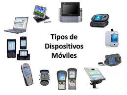
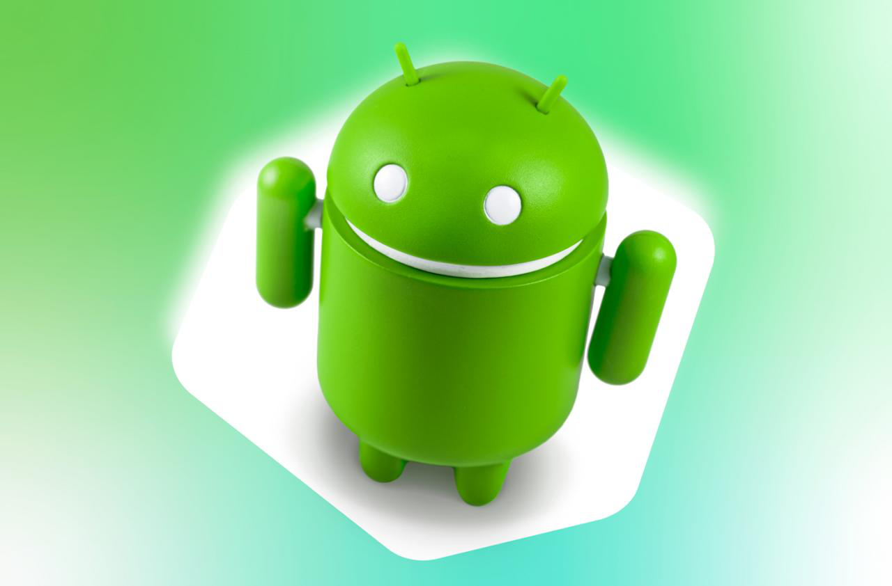
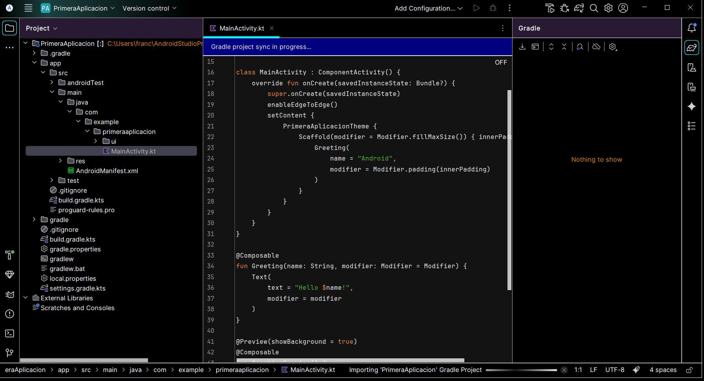
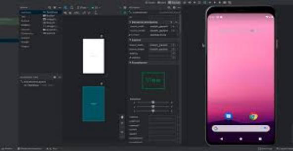

# PM-U1.1 - Análisis de tecnologías para aplicaciones móviles

Note: Antes de escribir una sola línea de código tenemos que conocer el terreno: qué dispositivos existen, qué redes usan y qué tecnologías de desarrollo tenemos delante. Esta presentación recorre el mapa completo del desarrollo móvil y termina en Android Studio, los emuladores y el ciclo de vida de una app. **El objetivo del tema es elegir tecnología con criterio, no memorizar marcas.**

---


 <!-- .element height="50%" -->

Note: Presentamos el módulo de Programación Multimedia y Dispositivos Móviles. Este primer tema es la puerta de entrada: sin entender los dispositivos y sus limitaciones, cualquier decisión de diseño es un tiro a ciegas.

---


## Índice

Note: Seguimos el hilo del tema 1: primero los dispositivos y sus limitaciones, luego las redes, después los sistemas operativos y las tecnologías de desarrollo, y cerramos con Android Studio, emuladores, estructura de la app y el administrador de aplicaciones.


### Índice I

- Dispositivos móviles: tipos y características
- Limitaciones para el desarrollo
- Redes móviles: de la 0G a la 6G
- Sistemas operativos móviles

Note: La primera mitad es contexto: **qué es un dispositivo móvil, qué no puede hacer y por qué las redes condicionan la app**. Insistir en que cada limitación se traduce en una decisión de diseño.


### Índice II

- Tecnologías: nativo vs multiplataforma
- Android Studio: instalación y primer proyecto
- Emuladores AVD: configuración y perfiles
- Estructura de la app y ciclo de vida
- ADB: el administrador de aplicaciones

Note: La segunda mitad es la parte práctica: **instalar el entorno, montar emuladores y manejar la app desde ADB**. Es exactamente lo que harán en las prácticas de los jueves.

---


## Dispositivos móviles

Note: Empezamos definiendo el protagonista: el dispositivo móvil. La definición formal importa porque cada pieza (batería, red, tamaño) es a la vez una limitación de desarrollo.


### Qué es un dispositivo móvil

- Aparato de pequeño tamaño y portable
- Autonomía con batería
- Conexión permanente o semipermanente a red
- Varias funciones: nació para llamar

Note: Definición formal: aparato de pequeño tamaño, portable, con autonomía de batería, conexión a red y varias funciones. **La función original era llamar por teléfono**; hoy un smartphone hace de cámara, GPS, navegador y consola. Pregunta al alumnado: ¿qué funciones hacían aparatos distintos hace 15 años?


### Rasgos comunes

- Portabilidad y entrada táctil/voz
- Conectividad Wi-Fi, Bluetooth, 4G/5G
- Energía limitada
- Almacenamiento flash
- Sistema operativo móvil

Note: Rasgos comunes de toda la familia: pantalla táctil, conectividad inalámbrica, **energía limitada** y almacenamiento flash. El contexto cambia constantemente: red, luz, batería, orientación. La app debe ser **responsiva, eficiente y resiliente**.


### Características principales

| Característica | Implicación |
|---------------|-------------|
| Tamaño | Portable, incluso en deporte |
| Movilidad | Sin cables, batería duradera |
| Conectividad | Inalámbrica: Wi-Fi, BT, 5G |
| Procesado | CPU multinúcleo, GPU |

Note: Las cuatro características principales: tamaño, movilidad, conectividad y capacidad de procesado. Secundarias: sistema operativo, ergonomía, diseño, tamaño de pantalla y gadgets compatibles. Conocerlas es conocer para qué diseñamos.


### Tipos de dispositivos

 <!-- .element height="70%" -->

Note: Tipos: **smartphones** (ordenador de bolsillo con cámara, sensores y GPS), **tablets** (tamaño intermedio, táctiles), **PDAs** (organizador, en declive), **eBooks** (tinta electrónica) y **wearables** (smartwatch). La misma app puede tener que vivir en los cinco.


### Un mercado enorme

- Más de 5 millones de apps en las tiendas
- 2020: más de 40 billones de descargas
- 2024: más de 250 billones (34% juegos)

Note: El mercado justifica el módulo: más de 5 millones de apps entre Play Store y App Store, y las descargas se han multiplicado por seis en cuatro años. Ojo con billones españoles: un billón son un millón de millones.

---


## Limitaciones

Note: Pasamos de las capacidades a las restricciones: aquí es donde el desarrollador sufre o se lucide.


### Limitaciones para el desarrollo

- Hardware: procesamiento y almacenamiento
- Diversidad de tamaños de pantalla
- Sensores y GPS: no todos los tienen
- Librerías de terceros sin soporte universal

Note: Limitaciones clave: el hardware limita procesamiento y almacenamiento; la diversidad de pantallas obliga a **diseño responsive**; no todos los terminales tienen todos los sensores; y no todas las librerías funcionan en todos los dispositivos. Antes de lanzar: **probar en varios dispositivos reales o emuladores**.

---


## Redes móviles

Note: Las redes han evolucionado generación a generación. No hay que memorizarlas al detalle, pero sí entender la tendencia: más velocidad, más dispositivos.


### De la 0G a la 2G

- 0G: walkie talkies, solo voz
- 1G: primera red celular, analógica
- 2G: digital, SMS y tarjeta SIM

Note: La 0G eran ondas de radio como los walkie talkies de la II Guerra Mundial. La 1G (Chicago, 1977) fue la primera red celular: analógica, equipos enormes, poca seguridad. La 2G trajo lo digital: **SMS y tarjeta SIM**. Cada generación responde a una necesidad.


### De la 3G a la 5G

- 3G: voz y datos juntos, 2 Mbps
- 4G: LTE, 60 Mbps, señal de TV
- 5G: 1-10 Gbps, IoT y realidad virtual

Note: La 3G (Japón, 2001) unificó voz y datos y permitió navegar fluido. La 4G (2010) llegó a 60 Mbps y trajo la señal de televisión al móvil. La 5G (presentada en Barcelona, 2017) multiplica por diez la velocidad y conecta IoT, wearables y realidad aumentada. La 6G, con satélites, está en investigación.

 <!-- .element height="55%" -->

Note: Imagen conceptual de la 5G: no es solo más velocidad, es **un ecosistema de dispositivos conectados**. Una app moderna puede hablar con sensores, relojes y gafas, no solo con un teléfono.

---


## Sistemas operativos móviles

Note: Todo lo anterior corre sobre un sistema operativo. Los SO móviles se organizan en capas, igual que los de escritorio.


### Organización por capas

1. Kernel: hardware, drivers, memoria
2. Middleware: módulos transparentes
3. Gestor de aplicaciones

Note: Tres capas: el **kernel** accede al hardware con drivers y gestiona procesos y memoria; el **middleware** permite que existan aplicaciones y es transparente para el usuario; y el **gestor de aplicaciones** ejecuta apps nativas o multiplataforma.


### Android

 <!-- .element height="65%" -->

Note: Android es el líder del mercado. Lo lanzó la Open Handset Alliance en 2007: 78 compañías lideradas por Google. Su pila: kernel de **Linux**, capa de abstracción de hardware HAL, runtime donde **cada app ejecuta sus propios procesos**, bibliotecas C/C++, framework de API Java y apps del sistema.


### iOS y otros

- iOS: derivado de Mac OS X, por capas
- Windows Phone, BlackBerry, Symbian
- Firefox OS, Ubuntu Touch
- HarmonyOS: IoT de Huawei

Note: iOS nació como iPhone OS, derivado de Mac OS X, con cuatro capas de abajo arriba: **Core OS, Core services, Media services y Cocoa Touch**. Su fuerte: hardware y software de la misma casa. Otros SO: Windows Phone (2010), BlackBerry, Symbian, Firefox OS (HTML5, gama baja), Ubuntu Touch y HarmonyOS de Huawei, pensado para IoT.

---


## Tecnologías de desarrollo

Note: Llegamos a la decisión que condiciona todo el proyecto: ¿nativo o multiplataforma? Y con qué lenguaje.


### Nativo vs multiplataforma

| | Nativo | Multiplataforma |
|---|--------|-----------------|
| Rendimiento | Máximo | Medio/alto |
| Coste | Un código por plataforma | Un código, varias plataformas |
| Flexibilidad | Total | Limitada por el framework |

Note: **Nativo** usa las herramientas propias de cada SO: máximo rendimiento y flexibilidad, pero tocaría programar dos veces para Android e iOS. **Multiplataforma** comparte el código: más barato y rápido, pero con las limitaciones del framework elegido.


### Nativo

- Android: Java y Kotlin
- iOS: Objective-C y Swift
- Windows Phone: C# con XAML

Note: El mapa nativo: en Android **Java y Kotlin**; en iOS **Objective-C y Swift** con Cocoa Touch; en Windows Phone C# con XAML. Kotlin es el lenguaje que Google señala como principal para Android y el que usaremos en este módulo.


### Multiplataforma: dos caminos

- Compilado a nativo: Xamarin, C# y .NET
- Basado en HTML5: PhoneGap, Cordova, Ionic
- Flutter: Dart y Hot Reload

Note: Dos familias multiplataforma: la **compilada a nativo** como Xamarin (C# sobre .NET, rendimiento nativo tras compilar) y la **basada en HTML5** como PhoneGap/Cordova o Ionic (una web empaquetada, menor rendimiento). Y **Flutter** de Google, con el lenguaje Dart y su **Hot Reload** que permite ver cambios sin reiniciar la app.

---


## Android Studio

Note: Elegimos Android + Kotlin, así que presentamos la herramienta oficial: Android Studio.


### Instalación y primer proyecto

 <!-- .element height="70%" -->

Note: Se descarga de developer.android.com. Está basado en **Int IntelliJ IDEA** y sustituyó a Eclipse como entorno oficial. En la captura: un proyecto recién creado con plantilla Empty Activity, el `MainActivity.kt` en Kotlin con Jetpack Compose y Gradle sincronizando dependencias. Dejar opciones por defecto en el instalador.

---


## Emuladores AVD

Note: Para probar sin móvil físico: el emulador. Se configura en el Device Manager creando un Android Virtual Device.


### Configuración clave

- API e imagen del sistema
- ABI: x86_64 o arm64
- RAM, cámara, aceleración
- Pantalla: pulgadas, dpi, safe areas
- Sensores: GPS, batería, red simulada


 <!-- .element height="65%" -->

Note: El emulador en acción junto al editor visual: se diseña la interfaz, se ajustan atributos y a la derecha corre el AVD con el launcher de Android. **Perfiles útiles**: gama baja (2 GB, 5 pulgadas), gama media (3-4 GB), tablet 10-12, foldable y Wear OS/TV. Cuándo dispositivo real: cámara avanzada, BLE/NFC, rendimiento fino y gestos.

---


## La aplicación Android

Note: Cómo es por dentro un proyecto Android: estructura de carpetas y componentes.


### Estructura del proyecto

```text
app/
 ├─ src/main/
 │   ├─ AndroidManifest.xml
 │   ├─ java/... o kotlin/...
 │   └─ res/ (layout, values...)
 └─ build.gradle(.kts)
```

Note: Estructura definida: bajo `app/src/main` viven el **AndroidManifest** (declara componentes y permisos), el código en java o kotlin, y `res` con layouts, strings, drawables e iconos. A la raíz, los archivos **Gradle** que construyen el proyecto.


### Componentes por capas

1. Activity y Fragment
2. ViewModel
3. Repository
4. Service, BroadcastReceiver, ContentProvider
5. UI: XML o Jetpack Compose

Note: Componentes: **Activity** es la pantalla, **Fragment** una parte reutilizable; **ViewModel** guarda estado; **Repository** accede a datos; **Service** trabaja en segundo plano. La UI puede ser XML tradicional o **Jetpack Compose**, la declarativa moderna que genera la plantilla.

---


## Ciclo de vida

Note: Lo más importante del tema para no perder datos: la app no vive para siempre, pasa por estados.


### Estados de la app

- Activo: visible e interactiva
- Pausa: sin foco, guardar estado
- Destruido: se liberan recursos

Note: Tres estados: **activo** en primer plano, **pausa/background** cuando otra app tapa o se bloquea la pantalla (hay que guardar estado y parar sensores) y **destruido** cuando el sistema o el usuario la cierran.


### Mapeo en Android

- Activo: `onResume()`
- Pausa: `onPause()` y `onStop()`
- Destruido: `onDestroy()`
- Restaurar: `onSaveInstanceState()`

Note: En una Activity: activo con `onResume`, pausa con `onPause` y `onStop`, destrucción con `onDestroy` que **no siempre está garantizado**. Para volver al mismo punto: `onSaveInstanceState` y persistencia en base de datos o Preferences.


### Del descubrimiento al borrado

- Descubrimiento → instalación
- Ejecución → actualización
- Borrado y sandbox local

Note: El ciclo completo del producto: descubrimiento en la tienda (ASO), instalación del paquete AAB/APK con permisos en tiempo de ejecución, ejecución con onboarding, actualización con migraciones y **In-App Updates**, y borrado que elimina el sandbox local.

---


## Apps existentes y ADB

Note: Cerramos con dos habilidades profesionales: entrar en una app ya hecha sin romperla, y manejar apps desde la consola con ADB.


### Modificar una app existente

1. Que compile y arranque
2. Cartografiar módulos y dependencias
3. Seguridad: secretos y permisos
4. Tests y refactor progresivo
5. Medir antes y después

Note: Guía para intervenir en una app ajena: levantar el proyecto, **cartografiar la arquitectura**, auditar secretos y permisos, añadir tests donde falten, refactorizar poco a poco y **medir antes y después**. Con feature flags para activar funciones sin forzar actualización.


### ADB: instalar y arrancar

```bash
adb install app-debug.apk
adb uninstall com.ejemplo.app
adb shell am start -n com.ejemplo.app/.ui.MainActivity
```

Note: El trío de herramientas del administrador: **ADB** para el dispositivo, **PM** para paquetes y **AM** para actividades. Con dos comandos instalamos y arrancamos una app concreta desde la consola, sin tocar el móvil.


### ADB: logs, permisos y archivos

```bash
adb logcat *:W
adb shell pm grant com.ejemplo.app android.permission.ACCESS_FINE_LOCATION
adb pull /sdcard/Download/log.txt .
```

Note: Y el día a día: `logcat` para leer warnings y errores, `pm grant` para dar permisos desde consola, `run-as` para mirar los archivos privados de la app y `push`/`pull` para copiar archivos. **Domina ADB y las prácticas de los jueves vuelan.**

---


## Resumen

Note: Cerramos amarrando los conceptos clave del tema antes de pasar a las prácticas.


### Resumen I

- El dispositivo limita: pantalla, sensores, batería
- Redes de la 0G a la 5G/6G
- SO por capas: Android e iOS
- Nativo vs multiplataforma: rendimiento o coste

Note: Primera parte del repaso: el dispositivo y sus limitaciones, la evolución de las redes, los sistemas operativos en capas y la eterna disyuntiva nativo/multiplataforma.


### Resumen II

- Android Studio: Kotlin y plantillas
- AVD para probar sin hardware
- Activity, ViewModel, Repository
- Ciclo de vida y ADB

Note: Segunda parte: Android Studio como entorno, los emuladores AVD con sus perfiles, los componentes por capas y el ciclo de vida con sus callbacks, más ADB como herramienta profesional. Con esto tienen el mapa completo del módulo.

---


## Prácticas

Note: Recordamos las tres prácticas de la unidad, pensadas para las sesiones de los jueves: 3 horas de módulo, con 2 o 4 de desarrollo según se haga en una o dos sesiones.


### Prácticas de la unidad

- P1.1: Plantillas de Android Studio
- P1.2: Emuladores y perfiles
- P1.3: ADB y el administrador

Note: Tres entregas: explorar las plantillas de proyecto, configurar emuladores con distintos perfiles y manejar la app desde ADB. Cada práctica indica si está pensada para 2 o 4 horas de aula.
