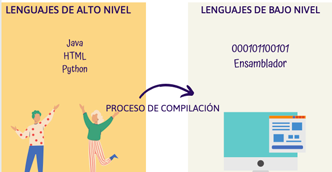
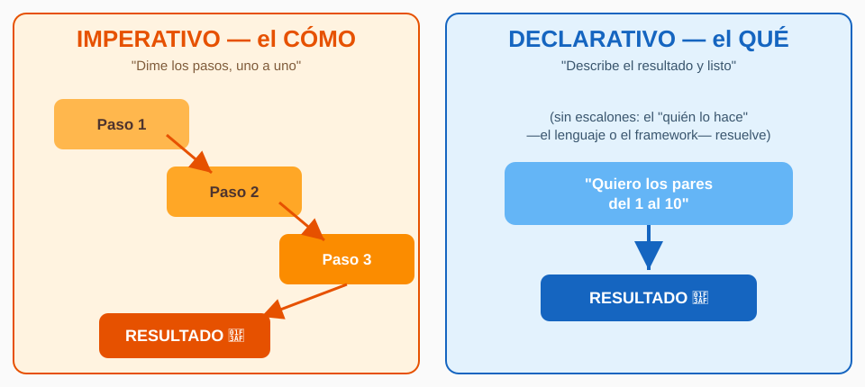
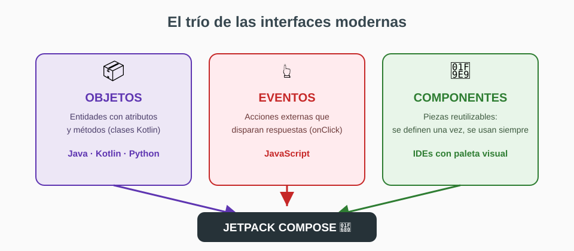
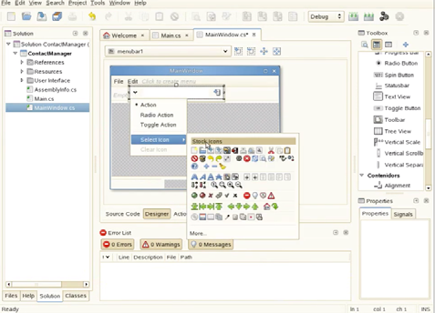
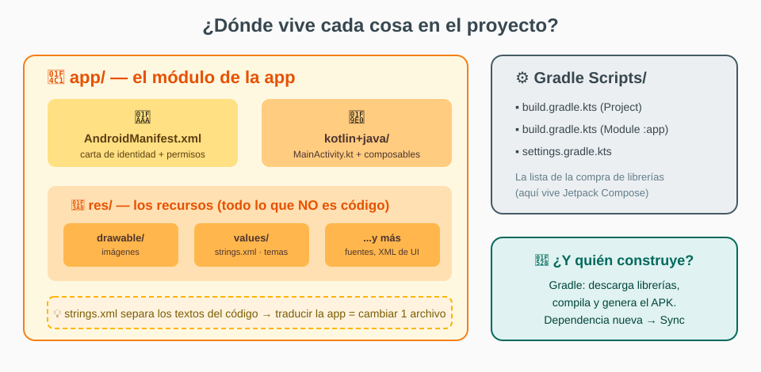
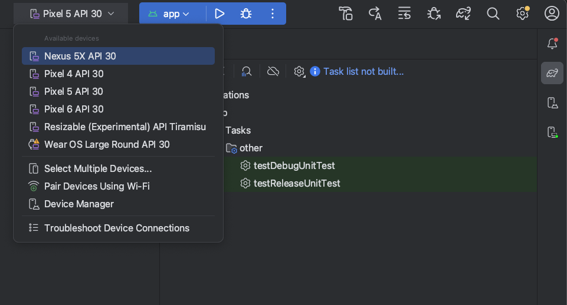

# DI-U1.1 - Introducción a la confección de interfaces

Note: Arranque de la unidad. Guion para abrir boca: "Hoy no venimos a programar: venimos a montar el taller. Al final de la clase vais a tener Android Studio instalado, vuestro primer proyecto creado y sabréis moveros por el entorno de diseño." 30 segundos y a la primera slide. **Definiciones que pueden caer aquí:** *Interfaz* = capa que permite la interacción entre persona y máquina. *IDE* = entorno de desarrollo integrado: editor + depurador + herramientas en un solo programa.

---


 <!-- .element height="50%" -->

Note: Presentación del módulo dentro de 2º DAM: Desarrollo de Interfaces (DI), módulo 0488 del ciclo. Este tema replica el guion clásico de introducción pero con la pila actual: Android Studio + Kotlin + Jetpack Compose. Anécdota para engancharles: el temario clásico enseñaba esta misma teoría con Java Swing, una tecnología de 2004; lo que van a ver hoy es la versión 2026 del mismo recorrido. Dejar caer que quien domine el entorno ganará semanas en las próximas unidades.

---


## Índice

Note: El mapa del día. Decir literalmente: "Primero el porqué (qué es una interfaz y qué paradigmas hay detrás), luego el dónde (las herramientas y Android Studio), y al final el cómo (primer proyecto y el entorno de diseño)." Prometerles que la segunda mitad es 100% práctica y con pantallas reales delante.


### Índice I

- ¿Qué es una interfaz? Lenguajes y niveles
- Paradigmas: imperativo vs declarativo
- POO, eventos y componentes: el trío ganador

Note: Primera mitad conceptual pero ligera: bajo/alto nivel (1 slide), imperativo vs declarativo (LA slide estrella con código), y el trío de modelos que gobierna las interfaces. Duración objetivo: 12-15 minutos. No profundizar más: esto es contexto, el plato es el entorno.


### Índice II

- Herramientas de edición e instalación
- Primer proyecto: Empty Activity
- Estructura del proyecto y entorno de diseño
- Casos prácticos y ejercicios

Note: Segunda mitad: la parte práctica. Instalación (la tendrán hecha como tarea), primer proyecto real, qué es cada carpeta del proyecto (esto les salva en todos los módulos del ciclo), y las zonas del entorno de diseño con capturas. Los casos prácticos que cerramos en clase son los ejercicios del bloque C.

---


## ¿Qué es una interfaz?

Note: Pregunta retórica a la clase antes de avanzar: "¿Qué pasaría si WhatsApp no tuviera interfaz?" Respuesta esperada: tendríamos que escribir comandos o código para enviar un mensaje. Ese es el punto: sin interfaz, todo programa exigiría ser programador experto. La interfaz es la traducción entre la lógica de la máquina y la persona.


### Lenguajes de bajo y alto nivel

 <!-- .element height="52%" -->

Note: El viaje del código: escribimos en alto nivel (comprensible para humanos) y el compilador lo traduce a bajo nivel (comprensible para la máquina). **Definiciones:** *Lenguaje máquina* = instrucciones en binario (0 y 1), las únicas que ejecuta el procesador directamente. *Ensamblador* = versión legible del lenguaje máquina, una línea por instrucción del procesador. *Lenguaje de alto nivel* = reglas cercanas al lenguaje natural (Kotlin, Java, Python). *Compilación* = traducción del código fuente a bajo nivel. Dato para la clase: Kotlin compila a *bytecode* que ejecuta una máquina virtual (JVM en PC, ART en Android) — por eso el mismo Kotlin funciona en sitios tan distintos.


### La interfaz traduce persona ↔ máquina

- Sin interfaz: todo programa exigiría saber su código fuente
- La interfaz es la **capa de interacción**
- Este módulo: **construirlas** con Android Studio + Kotlin + Compose

Note: Remachar la idea: cada app que usan tiene debajo miles de líneas que alguien escribió; la interfaz es lo único que les permite usarlas sin leerlas. Y el anuncio del módulo: aquí aprendemos a construir esa capa con las herramientas profesionales actuales. **Definición:** *GUI* (Graphical User Interface) = interfaz gráfica de usuario: la parte visual e interactiva de una aplicación (ventanas, botones, textos).

---


## Paradigmas: dos estilos

Note: LA transición conceptual del tema. Presentarlo como "dos filosofías de decirle cosas al ordenador". Antes de mostrar el código de la siguiente slide, hacerles pensar: "Si os pido los números pares del 1 al 10, ¿qué me diríais: los pasos para encontrarlos o directamente la lista?" Ahí está toda la diferencia.


### Imperativo vs declarativo

 <!-- .element height="46%" -->

Note: El dibujo lo dice todo: a la izquierda, escalones (paso 1, 2, 3... y al final el resultado); a la derecha, pides el resultado directamente. **Definiciones:** *Paradigma* = estilo o enfoque de programación que define la estructura de los programas. *Imperativo* = describe CÓMO resolver el problema, paso a paso (Java, C, Python, Kotlin). *Declarativo* = describe QUÉ se quiere obtener, sin los pasos (HTML, CSS, SQL). Chiste que funciona: "Imperativo es la receta de cocina; declarativo es pedir el plato al camarero."


### El mismo problema, en código

```kotlin
// IMPERATIVO: cómo obtener los pares
val pares = mutableListOf<Int>()
for (i in 1..10) {
    if (i % 2 == 0) pares.add(i)
}
```

```sql
-- DECLARATIVO: qué quiero obtener
SELECT numero FROM uno_a_diez WHERE numero % 2 = 0;
```

Note: Slide clave: comparación lado a lado del MISMO problema. Arriba, Kotlin imperativo: crear lista vacía, bucle, condición, añadir — cuatro pasos explícitos. Abajo, SQL declarativo: una frase que dice QUÉ quiero, y el motor decide cómo. Preguntar a la clase: "¿Cuál de los dos programas sabría cambiar de opinión el motor de base de datos para resolverlo más rápido?" — el declarativo, porque los pasos son cosa suya. Ese es el argumento de venta del declarativo para interfaces.


### El trío: POO + eventos + componentes

 <!-- .element height="48%" -->

Note: Los tres modelos que se combinan en las interfaces modernas. **Definiciones:** *POO* (programación orientada a objetos) = modelo basado en entidades (objetos) con atributos y métodos que interactúan entre sí (Java, Kotlin, Python). *Programación basada en eventos* = el flujo del programa lo determinan acciones externas, como pulsar un botón (lenguaje estrella: JavaScript). *Programación basada en componentes* = reutilizar módulos de software ya desarrollados y empaquetados; los IDEs permiten crear componentes visuales reutilizables. Mensaje final: en Compose los tres se dan cita — el composable es un componente (se define una vez y se reutiliza), reacciona a eventos (onClick) y se apoya en clases Kotlin.

---


## Herramientas de edición

Note: El panorama histórico de IDEs, actualizado. Contexto: la teoría clásica repasaba editores visuales de escritorio; hoy usamos el mismo concepto pero para móvil. Subrayar el patrón común que se repite en TODOS: paleta de componentes + lienzo + panel de propiedades. Cuando vean Android Studio reconocerán el patrón.


### El panorama

| Herramienta | Licencia | Lenguajes |
|-------------|----------|-----------|
| MonoDevelop | Libre | C#, .NET, Python |
| Glade | Libre | C/C++, Python, XML |
| **Android Studio** | **Libre** | **Kotlin, Java** |

Note: Tabla comparativa resumida (la completa está en la teoría). **Definiciones:** *Licencia libre* = software que puede usarse, modificarse y distribuirse sin coste (código fuente abierto). MonoDevelop: ecosistema de Unity (motor de videojuegos), multiplataforma Windows/macOS/Linux. Glade: diseñador de interfaces para GNU/Linux, muy ligado a XML. Y la tercera fila: Android Studio, libre y gratuito, el oficial de Android, basado en IntelliJ. Gancho: "¿Adivináis cuál usaremos?"


### MonoDevelop y Glade

 <!-- .element height="40%" -->

 <!-- .element height="40%" -->

Note: Los dos veteranos para que vean el patrón visual del que hablaba: ambos tienen paleta de componentes a la izquierda/centro, lienzo central y propiedades. Ese diseño de entorno viene de los 90-2000 y Android Studio lo hereda. Currículo honesto: "No los vais a usar en la vida probablemente, pero todo IDE visual que os encontréis se parece a esto."


### Android Studio: nuestra elección

 <!-- .element height="42%" -->

Note: El porqué de la elección, en 3 golpes: 1) Es el IDE OFICIAL de Android (hecho por Google, basado en IntelliJ IDEA) — el estándar profesional real: toda empresa de apps lo usa. 2) Gratuito, libre y multiplataforma. 3) Trae todo integrado: editor con autocompletado y errores en tiempo real, depurador, Git, emulador de Android integrado, y la vista de diseño en vivo para Compose. Cerrar con: "Igual que el temario clásico justificaba Eclipse porque era el estándar de su época, hoy ese papel lo cumple Android Studio."


### Instalación (¡esta semana!)

- Descargar: **developer.android.com/studio**
- Asistente → opciones por defecto (*Standard*)
- Primer arranque completa los componentes

Note: Tarea obligatoria esta semana: venir a la próxima clase con Android Studio instalado (cuenta el correo del profesor para dudas). Puntos que sí mencionar: descargar del sitio oficial según tu sistema operativo; instalar con las opciones por defecto (Standard); el primer arranque descarga el SDK y el emulador (paciencia, son varios GB). Ventaja enorme frente a los clásicos: NO hay que instalar nada aparte — el JDK viene embebido y el asistente de proyectos añade Compose solo. **Definiciones:** *SDK* (Software Development Kit) = kit de herramientas para desarrollar en una plataforma: librerías, emulador y herramientas. *JDK* (Java Development Kit) = kit para compilar código Java/Kotlin. *Emulador* = programa que simula un teléfono Android en el PC.

---


## Primer proyecto

Note: Momento estrella: crear el primer proyecto EN DIRECTO si hay proyector. Pasos: New Project → Empty Activity → nombre "MiPrimeraInterfaz" → Finish. Mientras Gradle sincroniza (tarda), explicar la siguiente slide del composable. Truco docente: dejar la creación del proyecto para el último tercio de la sesión y que lo repliquen en sus equipos a la vez.


### Empty Activity

 <!-- .element height="45%" -->

Note: La galería de plantillas del New Project. La nuestra: Empty Activity (la básica con Compose, lienzo limpio). Mencionar el criterio de elección sin entrar en la tabla completa (está en la teoría): las "Views" son el sistema clásico anterior (XML), Navigation UI trae menús de navegación ya montados, las de C++ son otro mundo (juegos y código nativo). Regla simple para ellos: "App nueva con Compose → Empty Activity."


### ¿Y para todos los SO? KMP

- Proyecto Android → plantillas de Android Studio
- Proyecto **Android + iOS + escritorio + web** → kmp.jetbrains.com
- Marcas plataformas y genera la estructura compartida
- Compose Multiplatform: la misma UI en todos

Note: Pregunta que siempre saldrá: "¿y si quiero mi app también en iPhone?" Respuesta de 2026: Kotlin Multiplatform, el asistente de JetBrains (kmp.jetbrains.com) donde marcas Android, iOS, escritorio y web y te genera el proyecto compartido. Comparte la lógica en Kotlin y, si quieres, la UI con Compose Multiplatform — lo mismo que están aprendiendo aquí, corriendo en todos los SO. No lo usamos en el módulo (primero dominar Android), pero que sepan que existe: es "un solo proyecto, todos los sistemas operativos". **Definiciones:** *KMP (Kotlin Multiplatform)* = tecnología de JetBrains para compartir código Kotlin entre plataformas. *Compose Multiplatform* = extensión de Compose que además de Android compila la UI a iOS, escritorio y web.


### Actividad y función composable

- **Actividad**: la pantalla del sistema que aloja
- `@Composable`: la **anotación** que va delante
- **Función composable**: la que **describe** la interfaz
- `setContent { }` monta una dentro de la otra

Note: La distinción estrella del tema, en dos niveles. Nivel 1: actividad = la pantalla del sistema (el "marco"); composable = la función que describe lo que se ve dentro (el "cuadro"). La conexión es setContent dentro de onCreate. Nivel 2 (el fino): @Composable es la ANOTACIÓN (lo que escribes delante), y la función marcada es la función composable. Ojo docente: la documentación oficial en español la llama "función de componibilidad" o "componible" — mismo concepto, nosotros diremos composable como la comunidad. **Definiciones:** *Anotación* = etiqueta que empieza por @ y aporta información extra al compilador. *Actividad* (ComponentActivity) = componente de Android que representa una pantalla con la que el usuario interactúa.


### Importar la librería

```kotlin
import androidx.compose.material3.Button   // un componente
import androidx.compose.material3.*        // todo Material 3
```

Note: Como en todo lenguaje con librerías, lo que se usa se importa, tras la declaración del paquete. En la práctica el IDE lo hace solo: Alt+Intro sobre el elemento en rojo. **Definiciones:** *Librería* = conjunto de clases y funciones ya implementadas que se reutilizan para no programar desde cero. *Import* = sentencia que trae un componente de una librería al archivo actual. *Jetpack Compose* = la librería de interfaces de Google para Android: sus componentes (botones, textos, contenedores) son funciones de Kotlin. Dato: Compose garantiza el mismo aspecto y comportamiento en cualquier dispositivo (apariencia Material Design 3).


### ¿Dónde vive cada cosa?

 <!-- .element height="52%" -->

Note: El mapa del proyecto — slide de ORO para ellos: esta estructura se repite en todos los proyectos Android que vean en el ciclo. Recorrer el dibujo: app/ es el módulo principal; dentro, el Manifest (carta de identidad: nombre, icono, permisos), el código Kotlin (MainActivity + composables) y res/ (recursos: imágenes en drawable/, textos en strings.xml, tema en themes.xml). A la derecha, los Gradle Scripts: la "lista de la compra" de librerías — ahí vive Compose. **Definiciones:** *AndroidManifest.xml* = archivo que declara los componentes y permisos de la app. *Recurso (res/)* = todo lo que no es código: imágenes, textos, temas. *Gradle* = sistema de construcción: descarga librerías, compila y genera el APK instalable. *APK* = paquete instalable de una app Android. *Sync* = sincronización que hace Gradle al añadir una dependencia. Y la buena práctica estrella: textos SIEMPRE en strings.xml (traducir la app = tocar un archivo).

---


## Entorno de diseño

Note: El tour por las zonas del entorno, igual que el temario clásico hacía con su IDE. Anunciarlo así: "Igual que un mecánico conoce su taller, nosotros vamos a conocer el nuestro: dónde están las herramientas y dónde se trabaja." Recomendarles perder miedo: las 4 pantallas siguientes son capturas reales de lo que verán al abrir su proyecto.


### Toolbar y ejecución

 <!-- .element height="48%" -->

Note: La barra superior con las acciones genéricas. El botón estrella: **Run ▶** (ejecutar la app). La flecha de su derecha abre el selector de dispositivos de la captura: emuladores disponibles (Pixel, Wear OS), dispositivos físicos por USB/Wi-Fi y el Device Manager (gestor de emuladores). **Definiciones:** *Toolbar* = barra de herramientas con accesos a las acciones más comunes del IDE. *Run* = ejecutar la app en el dispositivo seleccionado. *Device Manager* = panel donde se crean y administran los emuladores. Recordar: la primera vez que creen un emulador tarda unos minutos en descargar el sistema.


### Vista Split: código + preview en vivo

 <!-- .element height="50%" -->

Note: LA joya del entorno para Compose. Tres modos de edición: Code (solo código), Design (solo lienzo) y Split (ambos a la vez — el de la captura). En la preview se renderizan EN VIVO las funciones marcadas con @Preview, sin ejecutar la app: escribes Kotlin y ves la interfaz aparecer al lado, con el indicador "Up-to-date" cuando está sincronizada. **Definiciones:** *@Preview* = anotación que indica que un composable debe renderizarse en la vista de diseño sin ejecutar la app. *Preview* (previsualización) = render en vivo de la interfaz dentro del IDE. Momento marketing: "Esto en Swing no existía: es de las cosas que hace que programar interfaces hoy sea un placer."


### Palette, Component Tree y Attributes

- **Palette**: los composables listos para arrastrar
- **Component Tree**: la jerarquía de lo colocado
- **Attributes**: las propiedades del seleccionado

Note: El trío clásico de todo editor visual, versión Compose. Palette: la paleta con todos los componentes (textos, botones, campos, contenedores Column/Row/Box...) — clic y arrastrar al lienzo. Component Tree: el árbol con la jerarquía de lo colocado, como un explorador de carpetas pero de la interfaz. Attributes: el panel de propiedades del componente seleccionado (texto, alineación, color, enabled...). Cada componente visual corresponde a una función de Kotlin con sus parámetros = sus propiedades. **Definiciones:** *Paleta* = catálogo de componentes visuales del entorno. *Component Tree* (árbol de componentes) = representación jerárquica de los elementos colocados. *Attributes* (atributos/propiedades) = características modificables de un componente.

---


## Casos prácticos

Note: Los dos casos de la teoría, que son la demostración en vivo. Si hay tiempo, hacerlos delante de ellos; si no, quedan como ejercicio guiado del bloque C. Mensaje: "Todo lo que hemos visto se reduce a esto: declarar un composable, describir su contenido y asignarlo con setContent."


### Caso 1: primera pantalla

```kotlin
@Composable
fun MiPrimeraInterfaz() {
    Column(
        modifier = Modifier.fillMaxSize(),
        verticalArrangement = Arrangement.Center
    ) {
        Text("Mi primera interfaz")
    }
}
```

Note: El composable describe una columna que llena la pantalla (fillMaxSize) con el texto centrado (Center). Lo que NO hay que hacer es tan revelador como lo que sí: no se indica tamaño de ventana ni visibilidad — la interfaz ocupa toda la pantalla del móvil y se adapta sola. Diferencia con las ventanas de escritorio clásicas (donde había que dar ancho, alto y hacerla visible). **Definiciones:** *Column* = contenedor que apila elementos en vertical. *Modifier* = objeto que ajusta cómo se dibuja un componible (tamaño, padding, fondo...). *fillMaxSize()* = modifier que ocupa todo el espacio disponible.


### Caso 2: dos botones

```kotlin
@Composable
fun MiPrimeraInterfaz() {
    Row(
        modifier = Modifier.fillMaxSize(),
        horizontalArrangement = Arrangement.Center
    ) {
        Button(onClick = { }) { Text("Aceptar") }
        Button(onClick = { }) { Text("Cancelar") }
    }
}
```

Note: Misma jugada en horizontal: Row (fila) con dos Button centrados. Fijarse en la anatomía del botón Compose: el texto va DENTRO de las llaves del botón (un composable dentro de otro), y onClick recibe entre llaves el código que se ejecuta al pulsar. Remachar la equivalencia de modos: escribirlo en Code o arrastrarlo en Design genera EL MISMO código Kotlin — son dos vistas espejo del mismo archivo. **Definiciones:** *Row* = contenedor en horizontal. *Button* = botón; su contenido (el texto) se declara dentro. *onClick* = parámetro que recibe la acción al pulsar (evento).


### Resumen en 4 líneas

- **Kotlin** (lenguaje) + **Compose** (librería) + **Android Studio** (IDE)
- La **función composable** describe la pantalla
- **Code y Design**: dos vistas del mismo código
- Próxima unidad: los componentes en profundidad

Note: Cierre conceptual en 30 segundos: el trío de herramientas (lenguaje-librería-IDE), la pieza clave (la función composable que describe la interfaz) y el doble modo de trabajo (código y diseño, espejos del mismo archivo). Anticipar la próxima unidad: profundizar en los componentes y su disposición. Este es el momento de las preguntas lentas — dejar 2-3 minutos antes del cierre.

---


## Cierre

Note: Última pantalla: resolución del caso de la unidad + tareas. Dejarla proyectada mientras se van.


### Caso de la unidad: app de bienvenida

- ¿Componentes? Textos + un botón **"Entrar"**
- ¿Lenguaje? **Kotlin** · ¿IDE? **Android Studio**
- ¿Librería? **Jetpack Compose**

Note: La resolución del caso práctico de la unidad (la app de bienvenida del instituto) demuestra que ya sabemos tomar las cuatro decisiones previas de cualquier interfaz: qué componentes (textos y botón), qué lenguaje (Kotlin, de alto nivel), qué IDE (Android Studio) y qué librería (Compose). Mensaje: "esto que parece trivial es exactamente el análisis que se os pedirá en el proyecto final."


### Tareas

- Instalar Android Studio (developer.android.com/studio)
- Crear el proyecto **MiPrimeraInterfaz**
- Ejercicios: bloque A → B → C, con solucionario

Note: Las tareas de la semana, en orden de dificultad: 1) instalación (si alguien se atasca, correo con captura del error), 2) crear el proyecto y tocar el composable Greeting (cambiar el texto por su nombre — mini-reto), 3) ejercicios del tema: bloque A de conceptos, B de entorno y C de primer proyecto. El solucionario lleva los enunciados citados: intentarlo SIN mirar, que mirar la solución antes de intentarlo es la forma segura de no aprender.


### ¡Gracias por vuestra colaboración!

 <!-- .element height="35%" -->

Note: Cierre y agradecimiento. Frase para terminar con sonrisa: "Gracias por vuestra colaboración... y por los que ya han intentado instalar Android Studio antes de que acabe la clase: aprobado directo." Recoger dudas individuales mientras se despedinan, recordar que el material completo (teoría, ejercicios y solucionario) está en la web del módulo.
