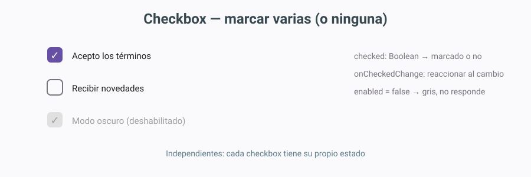
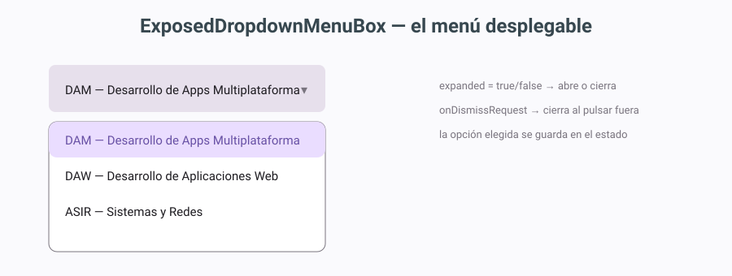
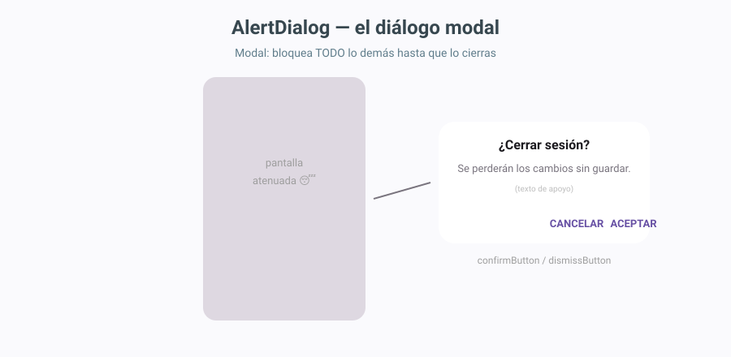
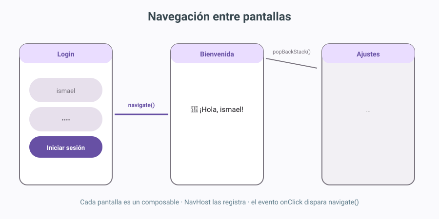

# DI-U2.1 - Clases y componentes

Note: Segunda unidad: la del catálogo de piezas. Frase de arranque: "En el tema 1 montamos el taller; hoy aprendemos a usar cada herramienta." Objetivos: componentes uno a uno con código y dibujo, contenedores, diálogos modales y navegación. Al final montan un login que navega y un reproductor en rejilla. **Definiciones posibles aquí:** *Componente* = elemento visual interactivo de la interfaz (botón, campo, casilla). *Contenedor/Layout* = componible que organiza a otros sin verse él mismo.

---


 <!-- .element height="50%" -->

Note: Recordar dónde están los materiales de la unidad anterior (web del módulo) y que esta unidad ya es 100% práctica: casi todo lo que se proyecta hoy lo tendrán que construir ellos en las prácticas. Este tema es EL corazón del módulo: componentes + disposición.

---


## Índice

Note: El guion del día: primero el contexto mínimo (POO exprés y contenedores), luego el catálogo de componentes con código y dibujo, después diálogos y navegación, y al final los dos casos prácticos que son los mini-proyectos del bloque C.


### Índice I

- El área de diseño en acción
- POO exprés: clases, métodos, atributos
- La pantalla y sus contenedores

Note: Primera parte: cómo insertar y borrar elementos en el entorno (ya lo conocen del tema 1, ahora lo explotamos), el repaso de POO que Compose necesita de verdad (conectándolo con el estado), y los contenedores: Column, Row, Box, Scaffold. Duración objetivo: 12 minutos — es el calentamiento.


### Índice II

- Componentes: Button, Text, TextField
- Selección: Checkbox, RadioButton, menú desplegable
- Diálogos modales y navegación entre pantallas
- Casos prácticos: login y reproductor

Note: Segunda parte: el plato. Los 6 componentes con su código y su dibujo lado a lado, el diálogo modal (con la receta de 3 pasos), la navegación con NavHost y los dos casos prácticos completos. Aquí se pasa la mayor parte de la sesión, con paradas para que prueben en sus equipos.

---


## El área de diseño en Compose

Note: Recordatorio exprés del tema 1, ahora en modo uso intensivo. Y una VERDAD que desmonta el temario clásico: en Compose NO hay paleta de arrastrar y soltar (eso era de Views XML y de los editores clásicos). El flujo es code-first: escribes Kotlin y la vista Split renderiza en vivo. Las zonas reales: el editor Code (donde se escribe todo), la preview de Split/Design (que renderiza al segundo y al clicar un elemento salta a su línea de código) y el Component Tree (la jerarquía, para seleccionar y borrar sin fallar el clic). El autocompletado (Ctrl+Espacio) sustituye a la vieja paleta: escribes Butt y te ofrece Button con sus parámetros. **Definiciones:** *Code-first* = el código es la fuente de verdad y la vista previa se genera desde él. *Autocompletado* = sugerencias del IDE al escribir (Ctrl+Espacio). *Component Tree* = árbol jerárquico de los elementos de la pantalla.


### Insertar y eliminar

- Insertar: **escribir la llamada** en el contenedor (¡no hay paleta!)
- Ayudas: **autocompletado** (Ctrl+Espacio) y clic en preview → salta al código
- Eliminar: clic en preview/Tree + **Supr**, o borrar la llamada entera en Code
- Las dos vistas son **espejos** del mismo código

Note: La mecánica del día a día, versión honesta: se inserta ESCRIBIENDO la llamada (el autocompletado con Ctrl+Espacio es la nueva paleta: escribes Butt y te ofrece Button con todos sus parámetros) y se elimina clicando en la preview (o el Tree) y Supr, o borrando la llamada completa a mano. La regla de oro de las llaves del tema 1 sigue en vigor: si borras a mano, cuenta las llaves — el error "Expecting )" al final del archivo casi siempre es una llave perdida más arriba. Anécdota: les recuerdo su primer error de compilación.

---


## POO exprés: lo que Compose necesita

Note: No es un repaso de 1º completo: es SOLO la parte que usa Compose. Contexto: "los componentes que veréis hoy son funciones de Kotlin que usan clases y objetos por todas partes; 5 minutos de POO y listo". **Definiciones:** *Clase* = plantilla que define estructura (atributos) y comportamiento (métodos). *Objeto/instancia* = ejemplar concreto creado a partir de una clase. *Constructor* = función que crea el objeto (en Kotlin va en la cabecera de la clase). *Método* = función dentro de la clase que define su comportamiento. *Atributo/propiedad* = variable que guarda una característica del objeto.


### Clase, objetos y métodos

```kotlin
class Circulo(
    var radio: Double = 1.0,    // atributo
    var color: String = "azul"  // atributo
) {
    fun area(): Double = Math.PI * radio * radio  // método
    fun crecer() { radio *= 2 }                    // método
}

val c = Circulo(radio = 2.0)  // objeto (sin "new")
println(c.area())             // 12.566...
```

Note: Una clase en Kotlin moderna: los atributos van directos en el constructor (con var para que sean mutables), los métodos en el cuerpo, y la instanciación es NombreClase(paréntesis) SIN new — herencia de la simplificación de Kotlin sobre Java. Truco para que lo recuerden: "en Kotlin, crear un objeto es llamar a una función: igual que Text(), igual que Button()". Conexión clave: los componentes que verán hoy son exactamente llamadas así.


### POO = el motor del estado

- `var contador by remember { mutableStateOf(0) }`
- El estado es una **propiedad observada** en un objeto
- Al cambiar → la interfaz se **redibuja sola**
- La POO no es repaso: es el motor

Note: La diapositiva que justifica el repaso: el famoso `remember + mutableStateOf` del tema 1 ES POO — una propiedad dentro de un objeto observable que, al cambiar, dispara el redibujado. Frase para la clase: "Cuando escribís contador++ y la pantalla se actualiza sola, no es magia: es un objeto notificando a sus observadores. POO en acción." Esto desarma el "¿y esto para qué sirve?" de siempre.

---


## La pantalla y sus contenedores

Note: El equivalente moderno de las "ventanas y paneles" clásicos. Jerarquía en 3 niveles: la actividad (la pantalla del sistema, ya vista), los contenedores (composables invisibles que ORGANIZAN), y los componentes (los que se ven e interactúan). Hoy nos quedamos en los dos niveles de abajo. **Definiciones:** *Actividad* = pantalla del sistema que aloja la interfaz. *Contenedor* = componible que organiza a otros sin pintar nada él mismo.


### Column, Row, Box: los 3 básicos

 <!-- .element height="48%" -->

Note: El dibujo de referencia de la unidad. Column: uno debajo de otro (formularios). Row: uno al lado de otro (botoneras). Box: superpuestos (texto sobre foto). Y la rejilla LazyVerticalGrid para cuadrículas. Cada uno con su Arrangement (separación/alineación). Pregunta a la clase: "¿cómo haríais una pantalla de perfil: foto arriba, nombre debajo, y dos botones en fila?" — respuesta: Column con una Row dentro. Ese anidamiento es el 90% del diseño.


### Scaffold: la pantalla con huecos

 <!-- .element height="48%" -->

Note: Scaffold es la pantalla Material completa con huecos preparados: topBar (cabecera), bottomBar (navegación inferior), floatingActionButton (el botón redondo) y content (el centro). Es el equivalente funcional del BorderLayout clásico: Norte=topBar, Sur=bottomBar, Centro=content. ADVERTENCIA estrella: el innerPadding — si no lo aplican al contenido, su primer texto queda TAPADO bajo la cabecera. Es EL fallo de clase más repetido. **Definiciones:** *Scaffold* = contenedor de pantalla completa con slots estándar. *Slot/hueco* = parámetro que recibe un componible. *FAB* = Floating Action Button, el botón flotante de acción principal.

---


## Componentes (I): acción y texto

Note: El catálogo empieza por los dos más usados: Button y Text. Metodo logia para todo el bloque: cada componente se presenta con su DIBUJO (cómo se ve) y su CÓDIGO (cómo se escribe), y siempre las mismas preguntas: ¿cuál es su evento? ¿cuál es su estado? Recordar que las propiedades de los clásicos aquí son PARÁMETROS de la función.


### Button

 <!-- .element height="44%" -->

Note: El componente de acción. Dos cosas que chancean al principio: 1) el texto NO es un parámetro — va DENTRO de las llaves (porque un botón puede contener texto, icono, lo que sea: composables dentro de composables); 2) el evento es onClick, una lambda que recibe TODO lo que debe pasar al pulsar. Jerarquías Material: Button (relleno, la acción principal), OutlinedButton (borde, secundaria), TextButton (solo texto, terciaria) — una pantalla tiene UNA acción principal. enabled=false lo pone gris y mudo. **Definiciones:** *Lambda* = función anónima entre llaves que se pasa como parámetro. *onClick* = parámetro-evento que se dispara al pulsar.


### Text

 <!-- .element height="42%" -->

Note: El más simple y el más usado: muestra texto (y puede llevar iconos inline). La buena práctica que quiero que les quede: en lugar de tamaños sueltos (fontSize = 22), usar los ESTILOS DEL TEMA (titleLarge, bodyLarge, labelSmall) — así toda la app es coherente y si mañana cambian el tema, cambia todo solo. maxLines + overflow=Ellipsis para cortar con "...". **Definiciones:** *Typography* = escala de estilos de texto del tema Material. *Ellipsis* = los tres puntos "..." al cortar texto que no cabe.


### TextField: el primero con estado

 <!-- .element height="42%" -->

Note: EL componente donde todos tropiezan la primera vez: el campo de texto NECESITA estado. La pareja inseparable: value (qué se muestra, viene de una variable) y onValueChange (qué hacer con cada tecla: guardarla en la variable). Sin onValueChange el campo no deja escribir. Visualizarlo como un círculo: estado → campo → tecla → onValueChange → estado → campo redibujado. Para contraseñas: PasswordVisualTransformation (los puntos) y teclado especial. **Definiciones:** *Estado (state)* = variable observable que guarda el dato y dispara el redibujado al cambiar. *onValueChange* = evento que entrega el texto nuevo en cada tecla (it). *visualTransformation* = cómo se MUESTRA el texto sin cambiar el valor real.

---


## Componentes (II): selección

Note: Segunda tanda: los componentes de elegir. Dos filosofías: Checkbox (multi-elección independiente) y RadioButton (elección exclusiva). Y el menú desplegable para listas largas. La distinción checkbox/radio es PREGUNTA DE EXAMEN CLÁSICA: "varias compatibles → checkbox; una excluyente → radio".


### Checkbox: marcar varias

 <!-- .element height="40%" -->

Note: La caja cuadrada: cada checkbox es independiente con SU estado (checked + onCheckedChange, la misma pareja de siempre). Ejemplo de pizarra: los extras de la hamburguesa (bacon ✓ queso ✓ cebolla ✗) — compatibles entre sí. Para varios en lista, mutableStateListOf y la comprobación "elemento in lista". enabled=false lo deja gris. **Definiciones:** *checked* = parámetro-estado que indica si está marcada. *mutableStateListOf* = lista observable: añadir/quitar dispara el redibujado.


### RadioButton: SOLO una

 <!-- .element height="40%" -->

Note: La exclusividad NO la da el componente: la da compartir el estado. El truco: todos los radios comparan su opción con la MISMA variable (selected = opcion == elegida) y todos la sobreescriben al pulsar (onClick = { elegida = opcion }). Al marcar uno, automáticamente deja de cumplirse la condición en los demás. Es el equivalente funcional del ButtonGroup clásico sin crear ningún grupo. Ejemplo: tallas S/M/L o forma de pago. Pregunta de clase: "¿qué pasa si cada radio tuviera su propia variable?" — se podrían marcar todos a la vez: el bug clásico.


### Menú desplegable

 <!-- .element height="42%" -->

Note: ExposedDropdownMenuBox: la caja que al pulsar expande la lista y la opción elegida queda escrita. Tres estados en juego: expandido (abierto/cerrado), seleccion (la opción elegida) y la lista de opciones. readOnly=true en el campo para que no escriban texto libre. El "valor por defecto" del selectedIndex clásico aquí es el valor INICIAL del estado de seleccion. **Definiciones:** *readOnly* = el campo no acepta escritura, solo elección. *onDismissRequest* = evento que cierra el menú al pulsar fuera.

---


## Diálogos y navegación

Note: Las dos piezas que convierten una pantalla suelta en una APLICACIÓN: el diálogo que confirma y la navegación que conecta. Primero la receta del diálogo (3 pasos, memorizable), luego el NavHost. Esta parte cierra el circuito conceptual: evento → estado → pantalla.


### AlertDialog: el diálogo modal

 <!-- .element height="46%" -->

Note: El diálogo modal: bloquea todo lo demás hasta responder (la pantalla de atrás queda atenuada). LA RECETA de 3 pasos, que quiero que se sepan de memoria: 1) una variable de estado booleana (mostrarDialogo), 2) un if (mostrarDialogo) { AlertDialog(...) }, 3) quien deba abrirlo pone mostrarDialogo=true en su onClick. onDismissRequest cierra al pulsar fuera; confirmButton y dismissButton son los dos componible-botones. Ejemplo real: confirmar compra de billetes. **Definiciones:** *Modal* = bloquea la interacción con el resto hasta cerrarse. *onDismissRequest* = evento de cierre por "fuera" o atrás. *Bottom sheet* = alternativa no modal: lámina que sube desde abajo.


### Navegación entre pantallas

 <!-- .element height="48%" -->

Note: El sistema estándar: Navigation Compose. Tres piezas: el NavHost (el contenedor que registra las pantallas por RUTA), el navController (el mando: navigate para saltar, popBackStack para volver) y el evento onClick que dispara el salto. Cada pantalla es un componible normal. Equivalencia clásica: crear la segunda ventana y hacerla visible → aquí es navigate("ruta"). Requiere añadir la dependencia de navigation-compose en Gradle y Sync. **Definiciones:** *Ruta* = nombre único que identifica una pantalla en el NavHost. *NavHost* = contenedor que registra y gestiona las pantallas. *navController* = objeto que ejecuta la navegación. *Back stack* = pila de pantallas visitadas; popBackStack la desapila (volver).

---


## Casos prácticos

Note: Los dos mini-proyectos que integran TODO: el login (campos con estado + validación + navegación) y el reproductor (rejilla). Son los ejercicios C3 y C4 del bloque C: los enuncio aquí, los construyen ellos. Si hay tiempo, hacer el login en directo; si no, dejarlo como reto guiado con el solucionario de referencia.


### Caso 1: login con navegación

```kotlin
Button(onClick = {
    if (usuario == "admin" && password == "1234")
        navController.navigate("bienvenida")
    else
        error = true
}) { Text("Inicio") }
```

Note: El corazón del login: el onClick comprueba credenciales y decide — navega o marca el error. Todo lo demás es montaña conocida: dos OutlinedTextField con sus estados, isError para pintar el error, la pantalla de bienvenida como componible aparte. El patrón de decisión (if/else dentro de la lambda) es lo nuevo: el evento puede CONTENER LÓGICA, no solo cambiar un texto.


### Caso 2: reproductor en rejilla

```kotlin
LazyVerticalGrid(
    columns = GridCells.Fixed(3),   // 3 columnas
    verticalArrangement = Arrangement.spacedBy(8.dp)
) {
    items(controles) { control ->
        Button(onClick = { }, modifier = Modifier.fillMaxWidth()) {
            Text(control)
        }
    }
}
```

Note: El reproductor: 9 botones en rejilla 3×3 con LazyVerticalGrid. Lo potente: la lista de controles es un listOf normal — añadir un décimo botón es añadir un décinto string, la rejilla se recompone sola. Y Lazy significa perezoso: solo crea lo visible (imprescindible para listas de 1000 elementos). Subida de dificultad del ejercicio: envolverlo en Scaffold con título y que STOP pida confirmación con diálogo.


### Resumen en 4 líneas

- **Componentes** = piezas con parámetros y eventos (onClick, onValueChange...)
- **Estado** = la pareja value/onValueChange que gobierna los campos
- **Contenedores** = Column/Row/Box/rejilla/Scaffold ordenan la pantalla
- **Diálogo modal + navegación** = aplicación completa

Note: El cierre conceptual: componentes (piezas), estado (la memoria de la pantalla), contenedores (el orden) y la combinación diálogo+navegación (app completa). Frase final: "Con esto que habéis visto hoy podéis construir el 80% de cualquier app que usáis a diario." Próxima unidad: eventos y estado en profundidad.

---


## Cierre

Note: Cierre con tareas y agradecimiento. Dejar proyectada la última pantalla mientras recogen dudas individuales.


### Tareas

- Mini-proyectos del bloque C: C1 a C5
- Primero B (componentes sueltos), luego C (integración)
- Solucionario con enunciados: intentar SIN mirar

Note: El orden recomendado: el bloque B es el entrenamiento (cada componente una vez) y el C los mini-proyectos que integran todo. El C3 (login) y el C4 (reproductor) son los casos prácticos de hoy — ya los han visto resolver, ahora toca construirlos. Recordar que el solucionario cita cada enunciado: intentar primero, mirar después.


### ¡Gracias por vuestra colaboración!

 <!-- .element height="35%" -->

Note: Cierre y agradecimiento. Frase para la sonrisa: "Gracias por vuestra colaboración: hoy habéis visto más componentes que apps de banca españolas en toda su historia." Dudas individuales mientras salen; el material completo (teoría, ejercicios, solucionario y slides) está en la web del módulo.
